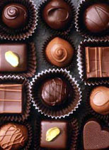

Pour celui qui veut se faire plaisir, pour celui qui déprime en attendant le printemps, pour celui qui ne déprime pas mais qui attend le printemps quand même, pour celui qui a envie de prendre quelques kilos devant la tv, pour celui qui est déjà trop gros mais qui s'en fout, pour le stressé, le pressé, le relax, le romantique, le geek, le vieux, le jeune, le moche, le gentil, le beau, le méchant, etc etc etc. <a hreflang="fr" href="http://www.chocoholic.free.fr/">Voici un site qui donne l'eau à la bouche...</a>
A éviter absolument, la recette des muffins au chocolat. Déjà c'est des muffins à la vanille avec un nappage chocolat dessus, et puis la pate est trop spéc, y a un bug dans la recette et quand ça cuit, ça devient une espèce de plastique.... beurk.  La banane au chocolat, c'était pas mauvais, parait-il.

<!-- excerpt -->
