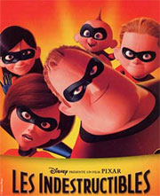
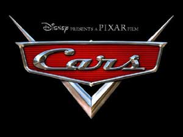

 Le film est sorti en dvd hier, on s'est jeté dessus... et on a bien fait ! 
Qu'est ce qui me permet de dire que c'était génial, moi qui n'ai pas le moins du monde l'esprit critique concernant les films, moi qui n'ai pas l'oeil entraîné à voir tous les petits défauts dans les films d'animations&nbsp;? Tout simplement qu'hier soir, devant le film, Ced ne s'est pas endormi!!!!! Et ça c'est de l'ordre de l'exceptionnel. La dernière fois que c'est arrivé, c'était devant "Un homme d'exception". Même "Le boulet" on avait dû le regarder en 3 fois! 
Bref, "les indestructibles", un chef d'oeuvre, quand on le mesure sur "l'échelle d'endormissement de Ced" (j'hésite à faire breveter cette méthode). Même les américains sont de cet avis, dès le premier jour de sa sortie, le dvd s'est vendu à 5 millions d'exemplaires en Amérique du Nord. 
Les animations sont parfaites, les dessins sont parfaits. On dirait de la vraie eau, les détails des cheveux, les mimiques des personnages, tout est réussi à la perfection.

Les personnages sont à la fois extraordinaires et criants de vérité. Je m'explique. Il y a Elastigirl, la femme dont le corps est élastique, Fleche, le garçon qui court aussi vite que l'éclair, Violette, la fille qui sait disparaître, etc.... donc ils sont extraordinaires (on est bien d'accord là dessus), mais ils forment une famille on ne peut plus normale. Avec les disputes entre frère et soeur, la mère au foyer un peu jalouse, le père qui va bosser le matin et qui revient le soir... 
L'histoire est agréable à suivre. En très résumé, les super-héros sont obligés d'avoir une vie normale et un travail normal. Ce travail emm...... le père de famille qui prend du poids et qui regrette son flamboyant passé. Un jour, il a l'opportunité de recommencer des missions de super-héros et il y entraîne sans le vouloir toute sa petite famille. 
Casting également surnaturel pour la distribution des voix: Lorie, Amanda Lear, Patrick Poivre d'Arvor, Holly Hunter, Samuel L Jackson... 
Bref, encore un chef d'oeuvre de <a href="http://www.pixar.com/featurefilms/index.html" hreflang="en">Pixar</a>, à voir et à revoir. 
Pour rappel, les autres Pixar sont Toy Story 1 et 2, A bug's life, Monsters Inc., Le monde de Nemo.... et "Cars", qui devait sortir en novembre de cette année mais qui sera reporté en juin 2006 car les studios Pixar pensent que c'est plus vendeur de sortir un film aux abords des grandes vacances. Cette sortie décalée permettra aussi au studio d&#8217;animation de négocier un contrat avec un nouveau distributeur (la Twentieth Century Fox et Warner Bros seraient sur les rangs).  
 
<a href="http://www.pixar.com/theater/trailers/index.html" hreflang="en">Pour voir les trailers dont celui de Cars </a> 
[Les films de Pixar sur Amazon.fr](http://www.amazon.fr/exec/obidos/redirect?tag=64kleblodesop-21&amp;path=search-handle-url/index%3Ddvd-fr%26field-keywords%3Dpixar)
