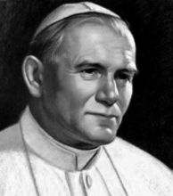

Beh oui, le pape est en sale état.

Au dernier bilan, aujourd'hui à 12h30, Joachin Navarro Valls, le porte-parole du Vatican, disait avec émotion que les fonctions vitales sont atteintes et la pression artérielle est très instable. Le pape est donc sous aide respiratoire et cardiaque. Il est toujours lucide et extraordinairement serein, il est entouré de ses plus proches collaborateurs, d'anesthésistes, d'infirmières, d'un spécialiste ORL, et de son médecin personnel. Ils sont là pour l'accompagner dans la mort car le Vatican refuse tout archarnement thérapeutique.  
Je ne suis pas croyante, ni chrétienne, je tiens juste à faire remarquer à qui lira ceci que c'est un moment historique que nous vivons. Une personnalité historique est en train de s'éteindre. Il est là depuis 1978, moi je n'ai connu que lui comme pape et dans peu de temps, qqun d'autre s'habillera de blanc. 
Le pape a été critiqué et c'est le moment de se demander pourquoi. Parce qu'il croit en Dieu, parce que dans l'aire du sida, il dit "baisez sans capote, baiser c'est pour faire des enfants", parce qu'il raconte toutes ces choses qui semblent être d'une autre époque. Parce qu'il assume ses croyances. Comme j'en ai déjà parlé dans le blog de [Marc](http://marc-blog.kataplop.net/index.php/) (et c'est aussi ce qui m'a décidé à faire ce billet), je pense que le pape est conscient de sa responsabilité en tant que symbole du catholicisme et que pour ses croyants, il tient le coup jusqu'au bout sans vouloir démissionner. 
Le pape est en train de mourir entouré des siens, des cantiques sont chantés autour de lui, on lui lit l'évangile, on lui a lu le chemin de croix (on est vendredi, le Christ est mort un vendredi à 15h00, il parait), il a reçu le sacrement des malades. Il faut rappeler que pour un chrétien, la mort n'est qu'un passage (pour beaucoup de personnes qui ne se disent pas chrétiennes aussi, d'ailleur). Le pape meurt comme un chrétien doit mourir, il trouve la paix. 
J'en parle parce que cela me touche en tant que personne. Personne ne peut être insensible à la mort du pape car il s'agit d'une des personnalités les moins belliqueuses de l'actualité. Personne ne peut être insensible à la mort, tout simplement.

De toutes façons, nul ne meurt tant qu'il vit dans les esprits.
