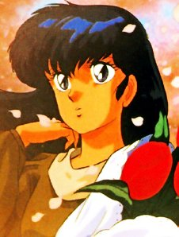

Après la borne d'arcade, les boutons du double joystick de la borne d'arcade, les extraits des émissions de jeux videos d'il y a des millénaires, Ced m'a passé le virus.

Il chantonnait doucement le générique de Gabbi (Gabbi Gabbi Gabbi l'ami l'ami l'ami des tout-petits, tourne le bouton, le bouton tout rond, et je chanterai des chansons!) et paf, me voila nostalgique aussi. Et c'est à mon tour de chantonner mes classiques (A la pension des mimosas, tout le monde est heureux, même si parfois le ciel, n'est pas toujours bleuuuueeeuuuuu.. C'est Juliette je t'aime, bande d'ignares!).

<!-- excerpt -->

Bref, cette vague de nostalgie prend tellement d'ampleur dans notre petit quotidien que je me vois dans l'obligation de la partager avec vous (Mais c'est Ced qui a commencé, on est bien d'accord là dessus)

Remèdes assurés contre les rides: 

 <ul> <li>Voici pour commencer un lien bien pratique, c'est un site qui permet de chercher le générique des chansons de dessins animés. On écrit ce qu'on veut et il nous renvoie dans google avec les résultats de la recherche. Ca s'appelle [Musique Uru](http://musiques.uru.org/) </li> <li>Un autre, à visiter si vous avez quelque chose à raconter dans un forum sur vos dessins animés préférés des années 80 [Nos tendres dessins animés](http://mangasdessins.forumactif.com/). A éviter au boulot si les baffles sont branchés, il y a une petite musique bien entrainante que beaucoup reconnaîtront (Allez je me la repasse olééé) </li> <li>[Casimir Land](http://www.casimirland.com/), délicieusement kitch... </li> <li>Des fiches, des quizz, des sondages, des forums.... sur [Albator à X-Or](http://albatoraxor.online.fr/visite.php?pag=accueil&amp;idf=005) </li> <li>[Planete Jeunesse](http://www.planete-jeunesse.com/), un site qui touche de près ou de loin à nos années de jeunesse. </li> <li>[Topkool](http://www.topkool.com/comicsbdmangas/oav1.htm), ZE référence en matière de NTRCDDADM (Nostalgiques des Tartines Rôties à la Cassonade Devant les Dessins Animés du Dimanche Matin ... c'est du vécu) </li> <li>[Gros Pixels](http://grospixels.com/site/), pour ceux qui préfèraient le luna park à leur TV</li> </ul>
