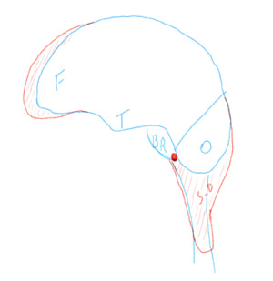
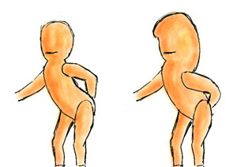

Nos amis les geeks sont des êtres mystérieux dont la particularité réside en grande partie dans les mouvements de la langue et des lèvres, la forme des organes phonateurs, l'écartement des cordes vocales et le flux d'air qui les traverse; ainsi que dans les mouvements des doigts sur le clavier (ça dépend du mode de communication, ça varie d'un phénomène à l'autre, ils utilisent souvent les deux modes de communication pré-cités). Nous remarquerons que malgré une configuration phonatoire apparemment normale (des études viennent seulement d'être engagées sur le sujet), le message qu'ils font passer est quant à lui relativement incompréhensible. Ils ont également un cerveau proéminent, qui passe bien au delà de l'arcade sourcillière vers l'avant du front et qui continue jusque dans la colonne vertébrale (si si!). Les aires cérébrales xtg (x-trem-geek) se trouvent dans la partie pré-frontale tandis que la partie sous-occipitale contient les aires de l'immobilité qui régissent la capacité à rester assis devant un ordinateur, les yeux fixés sur l'écran SANS pour autant faire atteindre au métabolisme le niveau d'autodestruction qui pourrait se mettre en route lors d'activités d'intense immobilité. Enfin, une petite aire située à l'interstice du bulbe rachidien, du lobe occipital et du lobe sous-occipital, régit la capacité à faire passer la presque totalité de la vie sociale par la voie digitalisée.

En référence au dernier billet dans le blog de [Marc le geek](http://marc-blog.kataplop.net/index.php/2005/04/06/71-vrac-de-geekerie?cos=1), voici en exclusivité les résultats de nos dernières recherches sur le développement physique cérébral dû à  l'XGA (extrem geekesk activity)

<!-- excerpt -->

Nous remarquons en bleu le cerveau humain normal avec l'aire frontale, temporale, occipitale et le bulbe rachidien à des proportions aujourd'hui bien connues des scientifiques. En rouge, nous remarquons les mutations cérébrales: l'aire sous-occipitale ou aire de l'immobilité, l'aire préfrontale baptisée aussi aire xtg (x-trem-geek) qui permet le stockage et l'utilisation de données compliquées voire extremement compliquées dans la vie quotidienne et l'aire sociale située entre le bulbe rachidien, le lobe occipital et le lobe sous-occipital.

Actuellement chez une minorité des humains, cette mutation risque fort de se généraliser au fur et à mesure du décès des plus anciens et de la naissance de bébés qui via la communication de leurs parents subiront également les mutations pré-citées.  
Nous estimons que dans 3 générations, les enfants viendront à la vie avec le CG (cerveau geek) transmis de façon génétique.

Du point de vue morphologique, le cerveau pré-frontal sera protégé d'une boite cranienne solide, sur le même principe que la transformation cartilagineuse à osseuse des frontanelles que nous connaissons déjà. Le côté sous-occipital quant à lui remplacera l'actuelle nuque et ne sera pas protégé par une coque osseuse. Les méninges: pie-mère, dure-mère et arachnoïde garderont leurs rôles actuels d'anti-choc, de nutrition et de thermostat mais la dure-mère sera appelée la dure-dure-mère dans les zones sus-cervicales (au dessus des vertèbres cervicales) car elle tentera de remplacer la coque osseuse pour la protection du lobe sous-occipital. 
Nous estimons que dans 5 générations, la dure-dure-mère sera complètement osseuse et les humains auront une boîte crânienne allant de l'arcade sourcillière jusqu'aux actuelles dernières vertèbres cervicales, voire même jusqu'à la première dorsale. Ces vertèbres quant à elles n'existeront plus.

La perte des vertèbres entrainera une immobilité du cou (l'humain n'aura de toutes façons plus besoin de tourner la tete car son univers se résumera à l'écran d'ordinateur). De plus, il sera du plus grand intérêt de rester immobile car le poids de ce surplus de matière grise et de couches osseuses apportera des risques mortels en cas de tentatives de mouvements (les rebelles n'auront qu'à bien se tenir!).  
L'immobilité du cou entrainera également une mutation vocale. Les muscles de la gorge disparaîtront, le larynx sera de plus en plus inutile et verra sa mutation s'opérer en plusieurs étapes. Tout d'abord, moins mobiles, les plis vocaux (ou cordes vocales) se relacheront et les sons qui sortiront par la bouche seront de plus en plus graves. Ensuite, l'intérieur du larynx ramollira à son tour et entrainera les cordes vocales dans des replis à plusieurs niveaux dans la trachée, la voix sera donc non seulement de plus en plus grave mais également moins stable (autre modification du timbre de voix s'apparentant à la mue pubère). Enfin, ces replis disparaîtront totalement et l'humain deviendra muet. Cela ne le handicapera pas outre mesure car déjà actuellement, avec le succès toujours grandissant des chats publics, appartés et forums de conversations, l'humain a tendance à utiliser de moins en moins ses organes vocaux.  
La mutation musculaire s'opérera également dans le dos afin de pouvoir supporter le poids de la tête. 
Nous mettons un point d'honneur à affirmer que les fonctions vitales comme la respiration et l'activité cardiaque ne seront jamais atteintes.

Voici les reproductions de l'humain actuel et de l'humain tel qu'il sera dans 3 à 5 générations.  
 
(Faut-il préciser que je n'ai jamais appris à dessiner...)
