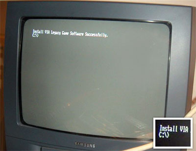

Après avoir galéré pour faire le câble VGA&gt;Peritel (vive la soudure), j'ai enfin reussi à avoir l'image du PC sur la TV, via le driver [arcmon.sys](http://www.mameworld.net/pc2jamma/downloads/arcmon.zip).
J'ai utilisé <a hreflang="en" href="http://www.ojosverdes.com/stormrider/mamescart/">ce cablage</a>. L'image RVB est vraiment nickel par rapport à la sortie TV composite qu'on trouve sur la plupart des cartes videos, il n'y a rien qui "bave", et ça n'explose pas les yeux.
Ce qui confirme qu'une TV européenne est très proche d'un moniteur de borne d'arcade.

C'est beau le DOS hein ? ;-) (J'ai installé <a hreflang="en" href="http://www.freedos.org/">FreeDOS</a>, une version libre 100% compatible MS-DOS)

<!-- excerpt -->

Maintenant il faut bidouiller la config d'AdvanceMAME pour que [l](http://members.cox.net/mame1/software.htm#advmame)'[a](http://www.mameworld.net/dosmame/myconfig.php)ffichage des jeux soit correct.
