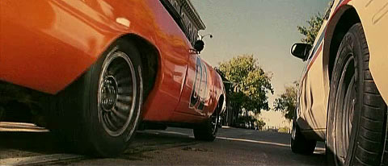
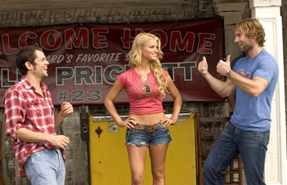

Nostalgie toujours... Cette série a peut-être aussi bercé votre enfance, au début tout début des années 80. Le personnage principal s'appelait "General Lee", était de couleur rouge, avait un drapeau sudiste sur le toit, et un célèbre klaxon. 
Vous voyez&nbsp;?

Oui oui, il s'agit de la fameuse Dodge Charger 1969 de la série "Sherif Fais Moi Peur". Et bien après Starsky et Hutch, en attendant Dallas, et La Petite Maison Dans La Prairie, la série vient d'être adaptée en film, et ça sort cet été aux Etats-Unis&nbsp;! [Le trailer est disponible sur Yahoo](http://movies.yahoo.com/feature/thedukesofhazzardqt1.html).

<!-- excerpt -->

Pour ceux qui ne connaissent pas l'histoire (très intellectuelle)&nbsp;:

_"Située de nos jours, l'histoire s'amuse à retracer les aventures rocambolesques de deux frères, Bo (Seann William Scott) et Luke (Johnny Knoxville) Duke, dans le petit comté de Hazzard. Aidés de leur ravissante cousine Daisy (Jessica Simpson) et de leur oncle, pour le moins casse-cou, Jesse (Willie Nelson), ils tentent coûte que coûte de sauver la ferme familiale menacée de destruction par le maire malhonnête et corrompu de la ville «&nbsp;le Boss Hogg&nbsp;» (Burt Reynolds). Leurs efforts sèment la zizanie au sein de la petite communauté de Hazzard régie par le simplet Shérif Roscoe P. Coltrane (M.c. Gainey)&#8230; Tout comme leurs incessantes poursuites à bord de la &#8220;General Lee,&#8221; leur fameuse Dodge Charger 1969."_

Faut sûrement pas s'attendre à un chef-d'oeuvre, mais si c'est du niveau de Starsky et Hutch, ce sera déjà pas mal ;-)

NB: Merci Simon pour la correction ;-)
