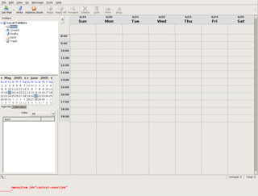

Les [premières captures d'écran du projet Lightning](http://diary.e-gandalf.net/?p=35), le concurent d'Outlook de la fondation Mozilla, ont été publiés. Pour rappel, il s'agit d'une sorte de mix entre Thunderbird, le client mail et Sunbird, le calendrier.

<!-- excerpt -->

On espère qu'une version beta sera bientôt disponible, apparement ce sera vers juin/juillet, sous forme d'extension pour Thunderbird.
