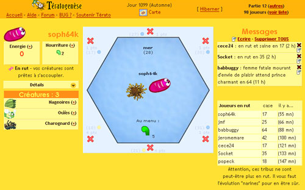

Etymologiquement, ça signifie création de monstres. Il s'agit d'un jeu de survie et d'évolution. Vous commandez une "tribu" de créatures qui va tenter de dominer le monde en étant la plus évoluée et en ayant la plus forte population. Mais vous aurez besoin des autres, puisque vous devez vous reproduire avec leurs créatures...

<!-- excerpt -->

Voici un petit aperçu d'une de mes bestioles, au milieu, la case 28 sur laquelle je me trouve, je suis dans l'eau. Les petites croix rouges autour montrent que je ne peux plus bouger parce que je n'ai plus assez de points d'énergie. Les petits points de couleur à coté de ces croix montrent quel sera le type de case sur lequel je me trouverai si je vais de ce coté là (bleu pour l'eau, jaune pour le sable, etc.)  
En bas à gauche, on voit que j'ai une tribu de 3 bestioles qui ont des nageoires, des ouies et qui sont charognards. Pour l'instant, je ne peux donc me déplacer que dans l'eau, mais je me déplace vite (grâce à mes nageoires, j'utilise moins de points d'énergie pour passer d'une case d'eau à une autre).  
Tout au dessus au milieu, il y a une icône "carte", ça sert à voir où se trouve la case sur laquelle je suis, ainsi que les cases des autres joueurs, donc si je vois que telle ou telle bestiole est en rut en case 47, par exemple, je regarde sur le plan quel est le chemin le plus court pour aller là-bas (en passant uniquement par des cases où je sais respirer). A droite on voit les messages que les autres joueurs envoient ainsi que la liste des joueurs en rut et l'endroit où ils se trouvent. Voila, c'est pas compliqué quand même....

On commence le jeu avec deux bestioles qui ont certaines caractéristiques physiques (des ouies, des narines, des nageoires...) La 1ère chose à faire est de manger. Puis on se rend compte qu'on a un certain nombre de points d'énergies par jour (10 à 12 points selon la carte sur laquelle on joue, mais on peut jouer en parallèle sur 5 cartes différentes avec une bestiole différente sur chacune). Il faut donc utiliser ces points d'énergie à bon escient car chaque action pompe de l'énergie&nbsp;: manger, se mettre sur une case où l'on peut respirer (inutile d'essayer de survivre sur du sable si on n'a pas de poumon), se mettre en rut, chercher une autre bestiole en rut pour se reproduire et créer une tribu. Les autres bestioles sont en fait de vrais internautes avec qui on cohabite sur les cartes de jeu, il est possible de leur envoyer des messages pour les allumer, pour favoriser la reproduction.  
Les petits qui naissent (un petit par reproduction) sont des mutants, ça signifie que par mutations d'ADN entre nos bestioles et celles avec qui on s'accouple, la nouvelle génération sera par exemple une génération "poumon" ou "charognard" ou un tas d'autres mutations que je n'ai pas encore eu l'occasion de découvrir. Ces mutations se transmettent à toute la tribu et permettent de pouvoir se poser sur un plus grand nombre de cases. Le but du jeu est d'avoir la plus grande tribu possible (= le plus grand nombre de caractéristiques physiques) car cela signifie avoir la meilleure évolution de son espèce.  
Il y a plein d'autres petits détails absolument fantastiques (les montres, les maladies, les attaques, la gestion du temps, les objets magiques, les nids...) mais tout ça ne m'est pas encore arrivé...

[Tératogénèse](http://terato.nainwak.org/) a été conçu pour fonctionner sur un navigateur moderne, sans installer aucun logiciel sur votre ordinateur&nbsp;: tout le "travail" est effectué par le serveur&nbsp;; pour l'utilisateur le jeu ne fait qu'afficher des pages HTML classiques avec quelques fonctions interactives. Ce choix entraîne quelques contraintes (nécessité de recharger la page à chaque action) mais permet une grande accessibilité.

Quel navigateur ? 
Tous les navigateurs permettent d'accéder au jeu et de lancer une partie. En revanche, certains ne sont pas "compatibles" car ils empêchent certaines fonctions essentielles du jeu (manger, se reproduire, attaquer).  
A ce jour, le jeu est compatible avec&nbsp;:

 <ul> <li>Internet Explorer 5/6&nbsp;: parce qu'il est le plus répandu (et non parce qu'il est meilleur), Internet Explorer a servi de base au développement de ce jeu.</li> <li>Mozilla 1.1, 1.2 Linux et Windows&nbsp;: je n'ai pas d'information sur les autres versions.</li> <li>Opera 7 beta&nbsp;: le jeu NE FONCTIONNE PAS avec Opera 6.</li> </ul>
