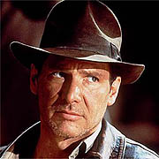

L'ébauche de scénario pour Indiana Jones 4 a apparemment reçu l'approbation de George Lucas et de Steven Spielberg. Mais avant que la Paramount puisse avancer, il faudrait déjà qu'Harrison Ford donne lui aussi son accord parce que jusque là il n'a pas encore lu le manuscrit&nbsp;!

Nathanson, le scénariste a été reçu chez Lucas à Bay Area, pour finaliser l'histoire. Il a également pris des notes de Spielberg, avec qui il avait déjà travaillé sur Catch Me If You Can et Le Terminal.

<!-- excerpt -->

Mais on se demande si le film sortira en 2006 comme prévu, vu le plannig chargé de Spielberg: il vient de terminer La Guerres Des Mondes, là toute de suite il va commencer à tourner son film sur le drame des Jeux Olympiques de 1972 et en janvier un film de Dreamworks sur Abraham Lincoln, avec Liam Neeson dans le premier rôle.
