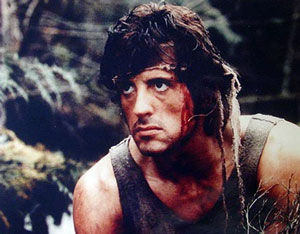

Nu Image/Millennium Films, a racheté la franchise "Rambo" à Miramax et le tournage devrait débuter en janvier 2006. Quel tournage me direz-vous ? Et bien Rambo 4 ! Et Silvester Stallone sera de la partie.

<!-- excerpt -->

Niveau scénario, en gros : "l'ex-béret vert John Rambo mène une vie rangée et paisible avec sa famille depuis une quinzaine d'années.  Faute de travail, ils doivent déménager. C'est là que de nouvelles difficultés se présenteront. La fille de 10 ans de Rambo devient une otage et l'ancien soldat devra agir." Ben oui c'est un Rambo quoi pas un film d'auteur ;-) Il y aura un second rôle dans le style de Rocky 5, Rambo sera accompagné d'un ptit nouveau pour mener à bien sa mission. Le film sera tourné en Inde et aux Etats-Unis.

Bon évidemment ça risque d'être une daube, mais avec le nom "Rambo" derrière, ça devrait marcher !
