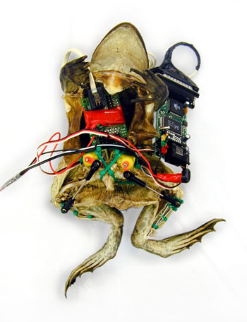

... dans un corps de grenouille morte. C'est l'insolite projet réalisé dans le cadre de "Experiment in Galvanism". La grenouille est en suspension dans un liquide transparent, un cable ethernet lui sort du ventre et ses tripes sont remplacées par des petites bijoux (?) d'électronique (vous savez tous à quel point j'aime l'électronique...hum). Des impulsions sont envoyées dans la pauvre bestiole morte et.... elle bouge ses pattes. 
Moi j'imagine le réalisateur de ce projet comme une espèce de geek post-adolescent-toujours-acnéique qui a été traumatisé par l'odeur de formol et les dissections de son cours de bio.

**Note de Ced&nbsp;: les âmes sensibles éviteront de cliquer sur "Lire la suite"** ;-)

<!-- excerpt -->

 <ul> <li>[Voir la bestiole qui bouge](http://www.conceptlab.com/frog/aceart-frog1.mov)</li> <li>Plus d'infos sur le site de [ConceptLab](http://www.conceptlab.com/frog/)</li> <li>[Mode d'emploi pour disséquer une grenouille](http://www.ac-rennes.fr/pedagogie/svt/applic/dissect/grenouil/gren02.htm) et mettre en exergue son système nerveux, au cas où ça vous passerait par la tête de faire ce genre de truc, cliquer sur les petits ciseaux pour faire avancer les images (non Ced, je ne disais pas ça pour toi, pas de dissection de grenouille chez nous, désolée)</li> <li>[D'autres projets très.... particuliers](http://www.conceptlab.com/) du même bonhomme, dont notamment la création d'un robot intelligent dans un cancrelat géant, d'un autre cancrelat équipé d'une minicaméra sans fil, et d'un verre de terre bionique/golémique/galvanique</li> <li>D'autres inventions et projets insolites sur le site d'[AceArtInc](http://www.aceart.org/twitch/index.html). J'aime particulièrement "The Blanket Project" et "Very Nervous System"</li> </ul> 

PS. Je ne savais pas ce que voulait dire "golémique" et en fait ça vient de Golem&nbsp;: "Cet être mythique symbolise la matière qu'on anime de façon artificielle et qui peut devenir un danger pour son créateur". 
La légende dit que c'est le rabbi Elijah de Chelm qui aurait conçu un golem qu'il destinait à être son serviteur, mais celui-ci devint si grand et si menaçant que son créateur en prit peur. Sur son front était inscrit le mot qui lui aurait donné la vie&nbsp;: EMETH (vérité). Le rabbi effaça la lettre E afin qu'il ne reste plus que le mot&nbsp;: METH (mort). Le golem se transforma alors en un tas de terre mais parvint cependant à étouffer son créateur.
