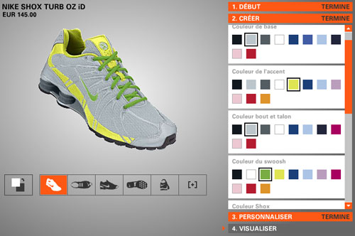
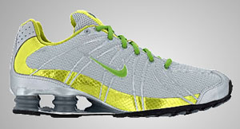
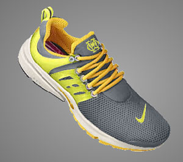
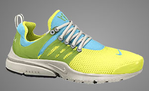
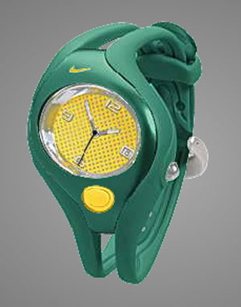
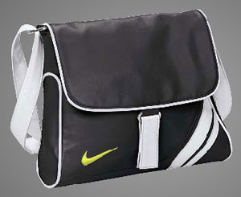

Je viens de passer une petite heure (oui je suis en congé aujoud'hui) à changer les couleurs des différents modèles hommes et femmes des Nike. Ma préférée reste la Presto (j'en ai eu, on est comme dans des pantoufles là dedans). Ce qui est cool avec la Presto Praia c'est qu'on peut se la jouer mode: les couleurs proposées pour changer l'insigne, les lacets, la semelle etc. sont celles de praia do Copacabana, Ipanema et Pepe. Braziiiiiiiiil

Des photos ici en dessous...

<!-- excerpt -->

Les modèles aux couleurs de 64k:

Et ses versions hommes et femmes Presto-Praia do Copacabana, le tout, fait par moi :-)

ce qui est cool aussi c'est qu'on sait toutes les personnaliser. Les Nike de course, de foot, de basket, de fitness, d'athlétisme... et pas que ça !!! Les sacs et les montres sont aussi de la fête&nbsp;!

A votre tour, sur le site de [NikeID](http://nikeid.nike.com/nikeid/)
