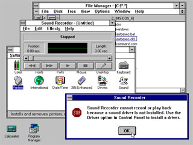

[GUIdebook](http://www.aci.com.pl/mwichary/guidebook/index) est un chouette site entièrement dédié aux interfaces graphiques, de [Lisa OS 1.0](http://www.aci.com.pl/mwichary/guidebook/interfaces/lisa/lisaos1/lisaos10) à nos jours. Il y a même une section splash screen, où on peut voir par exemple l'image de démarrage de [3dsmax 2.0](http://www.aci.com.pl/mwichary/guidebook/splashes/3dsmax), une [section icône](http://www.aci.com.pl/mwichary/guidebook/icons/components), etc.

<!-- excerpt -->

Ca c'est Windows 3.1 ;-)
