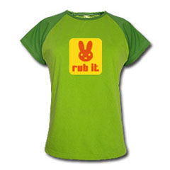
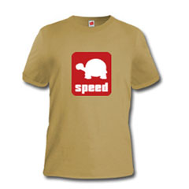

Grande nouveauté à partir de cette semaine: nous vous proposons de vous rendre sur [notre boutique en ligne](http://www.spreadshirt.net/shop.php?sid=67375) pour faire vos emplettes d'été depuis votre fauteuil.

 

<!-- excerpt -->

Tshirts pour hommes, pour femmes, débardeurs, chemises, manteaux, coupe-vent, strings, casquettes et même sacs, badges, stickers, nounours, tasses... Une gamme de plus de 50 produits déclinés dans vos couleurs préférées, avec les logos les plus mode du moment. 

Vous vous demandez sans doute où nous avons déniché tout ça... C'est très simple, sur [Spreadshirt](http://www.spreadshirt.net/). Spreadshirt est spécialisé dans le merchandising en ligne et est l´une des plus brillantes start-ups de ces dernières années. Lancé en 2002 sans capital initial, Spreadshirt emploie actuellement une quarantaine de personnes. L´entreprise se développe à l´international et est très profitable. Spreadshirt a été récompensé en 2002 par le trophée Hewlett Packard Business Innovation (Futuresax 2002 Award) . 
Le concept: Spreadshirt fournit toute la technologie et son savoir pour créer des produits et des boutiques personnalisées. Les partenaires n´ont pas besoin de se soucier de la gestion des stocks, de la création des produits et de la livraison. En plus, les visiteurs peuvent facilement et rapidement commander des produits et textiles personnalisés en ligne.

Comment seront faits vos tshirts?

Plusieurs types d'impression sont possibles:

 <ul> <li>**l'impression numérique** pour les tissus blancs ou clairs: les images imprimées paraissent plus ternes sur des supports foncés)</li> <li>**l'impression offset**: la plus haute qualité d'impression, imprimer des images multicolores sur des supports multicolores. Un inconvénient: le prix. Un tshirt qui aura pour prix de départ 18 euros en impression numérique, aura un prix de départ d'une bonne quarantaine d'euros en offset!)</li> <li>**la broderie**: la qualité est optimale mais ici encore, le coût n'est pas compris dans le prix de départ du produit. Demander une nouvelle typo pour faire broder ses insignes ou son logo sur une chemise coûtera par exemple 20 euros de plus que le prix de base de la chemise! Il faudra évidemment que Spreadshirt vérifie si votre typo est libre d'utilisation (ils sont très pointilleux sur le côté légal!).</li> <li>**le transfert**: Impression sans limite de couleur pour les motifs et les textiles. Le motif est d'abord imprimé sur une feuille de papier vinyl blanc mat. La feuille sera préssée à chaud dans les fibres du textiles. Si le motif n'est pas totalement étendu sur ses bords, un cadre blanc apparaîtra. Petit inconvénient supplémentaire, dès les 1ers lavages, les tons plus sombres peuvent s'éclaircir.</li> <li>Enfin, il existe aussi **l'impression "plot"**. Pour en avoir une idée bien concrète, c'est le style d'impression utilisé dans les magasins très très commerciaux genre Pimkie, H&amp;M, Etam... Bref, des produits de grande qualité à un prix démocratique. Enfin, l'impression plot est particulièrement recommandée lorsqu'il s'agit d'imprimer des logos ou des motifs simples comme les petits personnages de manga. Il s'agit donc vraiment de LA technique d'impression la plus en vogue actuellement!</li> </ul> 

C'est donc ce style d'impression, connu et apprécié du plus grand nombre, qui nous a semblé le plus adapté à notre boutique. Il existe deux techniques d'impression plot&nbsp;: le flocage et la flexographie. Le flocage donnera un résultat velouté sur l'image imprimée tandis que la flexographie donnera un effet lisse. Pour l'instant, les articles de notre boutique sont imprimés par la technique du flocage. Par la suite, nous aurons d'autres logos qui se prêteront mieux à la flexographie.

Ce w-e, Ced et moi avons donc tenté d'imaginer ce qui pourrait vous plaire comme logo, nous en avons pour l'instant choisi 3, que nous déclinons sur les articles que Spreadshirt met à notre disposition. D'autres logos sont en préparation mais nous attendons de voir si la boutique fonctionnera avant de les mettre en ligne.

Pour fêter cette nouveauté, nous avons décidé que chaque semaine, 2 tshirts (un pour homme et un pour femme) seront encore meilleur marché que les autres! Cette semaine, pour les femmes, c'est le tshirt citron vert au logo "Rub it" et pour les hommes, le tshirt beige au logo "speed" que vous pourrez acquérir pour seulement 17.90 &#8364;

Pour les amateurs de motos, de sports, etc. des logos seront bientôt disponibles. Enfin, pour ceux qui aiment customiser, nous vous laissons toujours la possibilité d'agrémenter les articles que vous commandez des textes de votre choix.
