Ce week-end, on n'avait rien de prévu. Samedi, on s'est improvisé une petite journée dans deux villes belges. Et dimanche, on s'est levés tot et on a été à la séance matinale d'Imagix (le cinéma de Mons) pour (enfin!) voir Star Wars Episode III (que j'ai trouvé génial)...

A vous de deviner où nous avons passé notre samedi...

MàJ: Voila le petit site bien sympa qui permet de [transformer une photo en pola](http://www.polaroidonizer.nl.eu.org/) avec un commentaire... (trouvé sur "[Comme la lune sur la branche](http://brindilles.net/lune/index.php)")

<!-- excerpt -->

1ère escale:

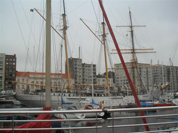

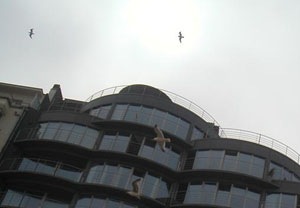

2ème escale:

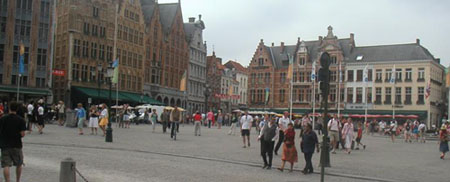

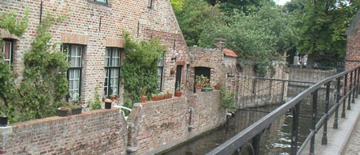

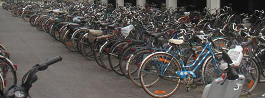

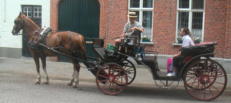

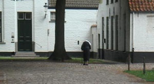

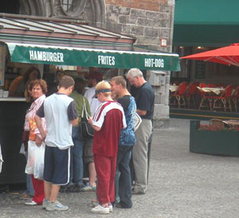

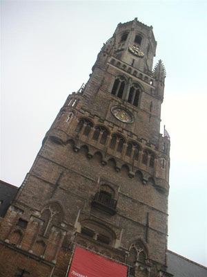

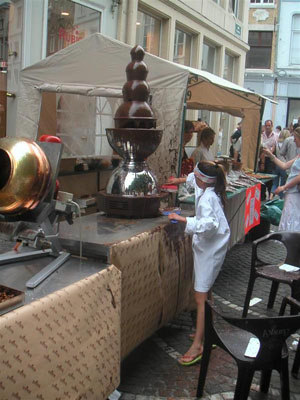

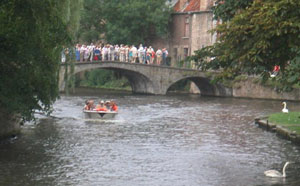

