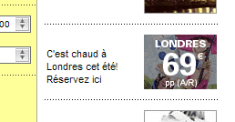

Ils pourraient quand même faire un effort pour retirer ce genre de pub du site d'<a href="http://www.eurostar.com/dynamic/_SvBoExpressBookingTerm?_TMS=1120821706344&amp;_DLG=SvBoExpressBookingTerm&amp;_LANG=FR&amp;_AGENCY=ESTAR" hreflang="fr">Eurostar</a>...

<!-- excerpt -->

D'un autre côté, si on se dit qu'il ne faut plus aller à Londres, parce c'est super dangereux avec ce risque d'attentat, probablement qu'on fait ce que les terroristes attendaient ? 
Certains prennent ça avec ["humour"](http://www.courrierinternational.com/dessins/dessin.asp?obj_id=53327) et ["dérision"](http://3couleurs.blogspot.com/2005/07/explosions-londres.html), c'est peut-être la voie à suivre...
