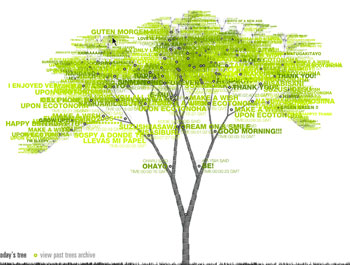

... Et si comme moi, vous n'avez pas d'arbre à planter sous la main, ajoutez tous les jours (si si!), une feuille virtuelle à [cet arbre-là](https://www.ecotonoha.com/ecotonoha.html). En fin de journée, on compte les feuilles et on plante un arbre pour chaque centaine. Et pour les non-matheux, j'ai fait le calcul, après 100 jours, vous aurez planté un arbre. Bref un peu plus de 3 arbres et demi par an. Si les 27000 visiteurs par mois du blog font ça (on va dire 25000 comme ça on est sûr d'avoir enlevé tous les bots), ça fait 91250 arbres plantés en un an. En quelques années, on aura refait l'amazonie rien que grâce à 64k (lol)

 <ul> <li>Pour ceux qui ont du mal&nbsp;: on clique sur l'arbre, ça zoome sur une branche, au bout de la branche, il y a des petits points rouge dont un qui est là rien que pour vous, on clique sur le point rouge et on laisse son message.</li> <li>Pour ceux qui ne sont toujours pas convaincus, voici [un site qui fait froid dans le dos](http://www.deforestation-amazonie.org/)</li> </ul> 

<!-- excerpt -->

Parce qu'aujourd'hui, on a vraiment besoin de petits gestes sympas et gratuits (ouais, chuis dans mon trip écolo, et alors?).

Le premier qui me dit "c'est pas de mettre une feuille virtuelle qui changera quelque chose, on n'est que des petits, on ne changera rien" (si si, je vous connais!) je lui colle une baffe virtuelle. Personne ne peut dire de quoi l'avenir est fait alors pour ne pas virer au gris, il faut y croire&nbsp;!
