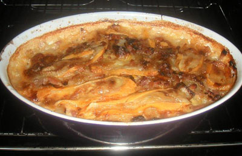

Il y a quelques années, j'étais partie à Flassigny (entre Sedan et Longwy, plus ou moins) avec des personnes handicapées mentales.
Il y avait un ossuaire. C'est horrible un ossuaire. C'est dans un cimetière, c'est comme une chapelle sauf que les murs sont faits de crânes et de tibias empilés les uns sur les autres. J'en garde une image très précise dans l'esprit. Il y avait des inscriptions en latin genre "ok c'est moche mais rappelez-vous que vous deviendrez comme ça aussi". Le truc bien sympa. J'avais pris des photos mais pas des numériques et elles sont ratées. Trop sombres. On ne voit rien.

<!-- excerpt -->

Bref, pour nous remettre de nos émotions, nous avons préparé une tartiflette. Moi qui déteste le fromage (à part gouda, chimay, maredsous et des trucs à pâte dure) , j'avais adoré le reblochon mélangé aux oignons, lardons, etc.
Pourtant j'avais un très mauvais souvenir du reblochon. Quand j'avais 11 ans, j'étais partie avec l'école en car pour 2 semaines à Marcinelle-en-Montagne. C'est près de Flumet, dans les Alpes Françaises. Marcinelle-en-Montagne est jumelée avec Marcinelle (de Belgique, triste réputation car c'est la ville "de Dutroux"), où j'allais à l'école en maternelles, primaires et secondaires. Donc, tous les élèves de 11 ans allant à l'école dans la région de Marcinelle partaient 15 jours dans les Alpes pour apprendre à skier et passer leur 1ère étoile. En revenant de là, ma meilleure amie, Elodie, avait acheté plusieurs reblochons car sa famille adore le fromage...et dans la chaleur de sa valise, les reblochons avaient coulé. Ca avait pué dans le car pendant les 12 heures de retour. Merci Elodie.

Enfin soit. Donc c'est à Flassigny lors de ma semaine avec des personnes handicapées mentales, que j'ai appris comment faire une tartiflette, pour nous remettre de nos émotions à cause de l'ossuaire.

Et ce soir, Ced aura l'immense bonheur de manger une tartiflette. En plein été. Et oui! Comme il y a du reblochon dedans, je suis tentée de dire que c'est un plat qui vient des Alpes.... Mais bon si je me trompe, faut le dire.

Pour 2 personnes, il faut:
<ul>
	<li>1/2 reblochon</li>
	<li>1 oignon</li>
	<li>200gr de lardons</li>
	<li>6 cuillères à soupe de crême fraîche (oui c'est riche comme plat)</li>
	<li>4 pommes de terre à chair ferme.</li>
</ul>
Tout d'abord, mettre cuire les pommes de terre dans de l'eau bouillante et salée. Le mieux, quand on cuit des pdt, c'est de les mettre dans l'eau alors qu'elle est encore froide. Je ne sais pas pourquoi mais ça change vraiment le goût (enfin je trouve). C'est ce qu'on appelle la cuisson à l'anglaise, je crois.
Pendant que les pommes de terre cuisent, on émince l'oignon mais pas trop finement, on le fait transpirer 2 ou 3 minutes dans une cuillère à soupe de becel puis on ajoute les lardons et on laisse cuire sur feu vif pendant 3 ou 4 minutes. Quand je fais des oignons et des lardons, j'évite de mettre la hote, sinon ça cuit plus fort parce que le jus s'évapore trop vite, puis ça attache, ça pue et ça donne un mauvais goût.
Après il faut attendre un peu que les pommes de terre aient fini de cuire. Pour voir si c'est bien cuit, on pique avec un couteau et s'il entre facilement, la cuisson est finie.
On coupe les pdt en tranches (j'ai essayé une fois de couper en tranches avant de les mettre à cuire mais j'ai laissé trop longtemps dans l'eau alors elles sont devenues farineuses, c'était dégueux) et on les place dans le fond d'un plat à gratin préalablement beurré (le mien sur la photo est un plat de deux personnes, il mesure à peine 30 cm de long sur à peine 20 cm de large). Au dessus des pommes de terre, on fait une couche d'oignons-lardons, puis une couche de reblochon coupé en petits morceaux ou en tranches (selon les gouts), puis de nouveau une couche d'oignons-lardons, puis encore du reblochon s'il en reste. On termine en versant quelques cuillères à soupe de crême fraîche et hop on enfourne dans un four très chaud. Le plat ne doit pas rester longtemps dans le four parce que tout est déjà cuit. Il faut surveiller la cuisson et quand le fromage est bien doré et gratiné sur le dessus, hop c'est prêt... Sur ma photo, c'est déjà cuit pour le souper de ce soir... c'est encore meilleur quand c'est réchauffé...

Une variante est de faire un grand plat avec plusieurs étages de pommes de terre et plusieurs étages d'oignons-lardons puis de couper la "couenne" du reblochon et le mettre tel quel sur le tout. Eventuellement couper son épaisseur en deux et recouvrir le plat pour que ça coule bien partout.
