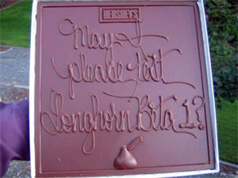

En envoyant du chocolat à Microsoft. Peut-être inspiré par le récent <a href="http://64k.be/index.php/2005/07/18/234-les-chocolats-wonka-existent-vraiment" hreflang="fr">Charlie et la chocolaterie</a>, un passionné désirant recevoir une invitation pour tester la nouvelle version beta de Windows Longhorn a envoyé [1 kilo de chocolat](http://adamjh.blogspot.com/2005/07/passionate-customers-make-for.html) via FedEx, à Paul Donnelly, un des test managers. L'invitation lui a été envoyée et le chocolat distribué.

<!-- excerpt -->
