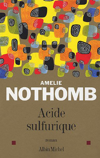

Et oui, qui dit rentrée littéraire, dit Le nouvel Amélie Nothomb. Acide Sulfurique. Les critiques disent déjà qu'il s'agit d'un mauvais bouquin. Oui, mais il y a certains critiques qui sont allergiques au succès et aux styles littéraires qu'on reconnait. Genre le style Amélie Nothomb: sarcastique, ironique, cinglant.. sulfurique.

<!-- excerpt -->

Pourquoi disent-ils que c'est un mauvais bouquin? Parce qu'il s'agit d'un réality-show et que depuis quelques temps, comme chacun sait, les réality-show ont la cote. Donc tout le monde les critique (c'est gnangnan, c'est pour vendre, simple business...) mais tout le monde (ou presque) se sent bien dans son rôle de voyeur. Donc les critiques critiquent aussi mais sont tout contents de se mettre devant leur tv avec femme et marmaille pour la soirée "Prime-time" du vendredi. Ils ont l'oeil ouvert à tout ce qu'il sera possible de critiquer, afin d'enfiler leur cape noire à grand col et leurs canines en plastique et, lors de leurs 30 secondes de "chronique-de-gloire" descendre en flêche, le plus méchamment possible, les "pauvres" producteurs de réality-shows et leurs futures richissimmes "vaches-à-lait".

Donc, ce nouveau roman est un réality-show. C'est un peu comme la bolo, c'est aussi bon (si pas meilleur) quand c'est réchauffé.  
Ce nouvel Amélie Nothomb est (parait-il) une copie des autres Amélie Nothomb. Des personnages principaux féminins dont l'une est moche, conne et méchante, et persécute l'autre qui est belle, gentille et intelligente. Le tout mixé avec des noms impossibles (genre Plectrude, Prétextat ou Textor), des dialogues faramineux et une situation cocasse, qui est ici de mettre plein de gens qui ne se connaissent pas encore dans un camps de concentration, des caméras partout, filmés 24h/24, ils rêvent de devenir staaaaaar, ils attendent la glooooooire.... tapez 1 pour sauver Pannonnique, 2 pour sauver Zedna et 3 pour sauver Prétextat, par sms au 3610 et vous gagnerez peut-être un logo d'enfeeeeer pour votre mobaaaailllle... (hum je m'égare là)

Bref bref bref, j'ai adoré les précédents, j'adorerai celui-ci (je sens poindre à l'horizon une subite envie de Ced de me faire un cadeau).

Ce que disent les critiques, c'est que, outre le fait qu'Amélie Nothomb a sorti l'artillerie légère en se moquant (elle-aussi) des réality-show, elle a également ressorti la bonne vieille formule magique des dialogues, des prénoms et du titre qui fait mouche (après Mercure, voici Acide Sulfurique) et qu'elle va se faire plein de sous parce que nous, pauvres mortels (surtout moi), nous ne pouvons pas nous empêcher de nous dire que nous avons pris un pied d'enfer à lire les précédents et qu'il n'y a pas de mal à se faire du bien avec le nouveau. Voila, donc ils disent qu'elle est paresseuse et qu'elle en devient fatiguante.  
Je ne suis pas trop de cet avis. Suivant avec intérêt la moindre interview d'Amélie Nothomb <del>et ayant lu chaque bouquin au moins 6 fois</del>, je pense que j'ai au moins un tout petit peu compris sa façon de fonctionner, et je suis persuadée que ce bouquin est aussi recherché et subtil que les précédents... et même si je ne l'ai pas encore lu, je suis sûre que je vais y trouver un tas de petites allusions aux bouquins précédents (des cadeaux pour ses fidèles lecteurs), un tas de petits trucs cachés, sa formulation de phrase toujours épatante, son vocabulaire....

J'ai un peu tiqué sur [la critique de ce type](http://www.lafactory.com/Rentree_litteraire/Albin_Michel/Acide_sulfurique_-_Amelie_Nothomb/), et je sens qu'il vient de lire le bouquin et qu'il a toujours autour de lui les effluves ironiques et sarcastiques d'Amélie Nothomb (vous me direz si je me trompe, moi je trouve que ça se sent à sa façon d'écrire). Ceci dit, il avoue quand même qu'elle a du talent (il faudrait être analphabète pour ne pas s'en rendre compte), et il nous invite à aller plutôt (re)lire la Biographie de la Faim. J'aurais plutôt renvoyé les gens vers l'Hygiène de l'assassin ou vers Mercure ou Antéchrista (où également, laideur se confond avec beauté, et méchanceté avec gentillesse)

[Pour le commander sur Amazon.fr](http://www.amazon.fr/exec/obidos/ASIN/2226167226/64kleblodesop-21)

Autre billets sur Amélie Nothomb:

 <ul> <li>[Si on frappe à ta porte, ouvre](http://64k.be/index.php/2005/03/03/45-si-on-frappe-a-ta-porte-ouvre)</li> <li>[Cosmétique de l'ennemi](http://64k.be/index.php/2005/03/29/89-cosmetique-de-lennemi)</li> </ul>
