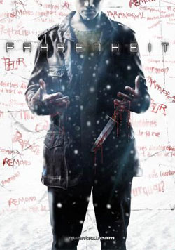
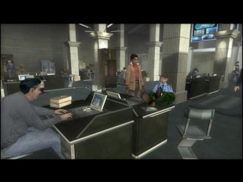

Hier, on a passé la soirée à découvrir le dernier jeu du studio [QuanticDream](http://www.quanticdream.com/), <a href="http://www.gamezine.net/test-331.html" hreflang="fr">Fahrenheit</a>. Et bien c'est un jeu très prenant. Ou plutôt très angoissant.

Tout commence par un assassinat dans les toilettes d'un petit resto. Lucas Kane, un des héros du jeu vient d'assassiner quelqu'un, mais il ne sait pas pourquoi.

En guise d'introduction, David Cage, l'auteur du jeu, vous propose en personne, ou plutôt en 3D, un tutorial où la prise en main des personnages vous sera expliquée. Vous pourrez diriger 3 personnages, Lucas Kane ainsi que deux enquêteurs, Carla Valenti et son acolyte, Tyler Miles. Chacun ayant pour but la vérité. Le jeu fonctionne un peu à la manière des livres dont vous êtes le héros, avec plusieurs choix posibles. Avec en plus des scènes d'actions.

Lucas a souvent des visions, des flashs. On a sursauté plusieurs fois en moins de 2 heures de jeu. Niveau contrôle, le jeu innove. Le stick droit sert à diriger le personnage tandis que le stick gauche sert à effectuer les actions. Par contre les mouvements de caméra augmentent le côté angoissant mais c'est au détriment de la jouabilité. Par moment il y a mêmes des séquences à la Track'n'Field, lorsque que le personnage doit effectuer un effort.

<!-- excerpt -->

 

Au niveau graphique, tout est également mis sur l'ambiance. Certains décors sont moins bien réussis mais les personnages, eux, sont très expressifs et très bien animés (ou très bien "motion-capturés").

Ce qui ressort le plus du jeu, c'est son aspect cinématographique. On a l'impression de regarder un film tellement la mise en scène est impressionnante. Mais cette fois on peut décider du déroulement de l'histoire. On y retourne ce soir ;-)

NB: Fahrenheit est sorti sur PC, Xbox et Playstation 2.

MàJ&nbsp;: Clubic vient de publier [son test](http://www.clubic.com/test-jeux-video-1419-0-fiche-jeux.html), très enthousiaste
