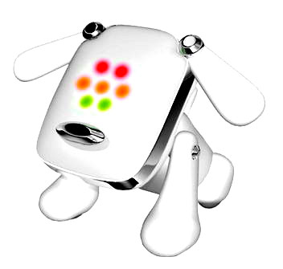

<del>Comme mon annif c'était hier et que j'ai (encore) envie de plein de cadeaux</del> Comme ça faisait longtemps que j'avais envie d'un petit vrac de gadgets...

 <ul> <li>[Soho.fr](http://www.soho.fr/), archi connu mais tant pis je le mets quand même</li> <li>[Technosexual](http://www.technosexual.org/), geek et chic, la page d'accueil est un peu austère mais il y a quelques trucs pas mal du tout</li> <li>[I want one of those](http://www.iwantoneofthose.com/), trop plein de petits trucs inutiles (donc forcément géniaux)</li> <li>[GadgetGrave](http://www.gadgetgrave.com/), le pire du pire...</li> <li>[ThinkGeek](http://www.thinkgeek.com/),je veux, je veux, [je veuuux](http://www.thinkgeek.com/cubegoodies/toys/6748/), trop fort le [Monsieur Patate-Darth Vader](http://www.thinkgeek.com/cubegoodies/toys/726d/)</li> <li>[GeekStuff4U](http://www.geekstuff4u.com/index.php?cPath=39), et comme je suis gentille, je vous envoie direct dans la page de gadgets (Mouahahaha l'[iDog](http://www.geekstuff4u.com/product_info.php?manufacturers_id=&amp;products_id=198))</li> <li>[The Gadgeteer](http://www.the-gadgeteer.com/), un peu trop sérieux à mon goût mais il y a de chouettes trucs quand même</li> <li>[Cribcandy](http://www.cribcandy.com/), y a un de ces bazaaaars sur ce site! [Je veuuuuux](http://www.unicahome.com/catalog/item.asp?id=475)&nbsp;! Et je veux [l'inflatable latex room](http://www.kissmachine.org/irewako1.html) aussi, hooooooo et [un écran qu'on peut traverser](http://www.fogscreen.com/), hooooo [des plantes qui poussent dans des oeufs](http://www.elsewares.com/commerce/product_info.php?products_id=324)....</li> <li>[Tomy](http://www.tomy.co.jp/top/index.asp) (parce que j'ai envie d'avoir un lien japonais sur le blog)</li> </ul> 

<!-- excerpt -->

Je le sens jusqu'ici, vous n'osez pas demander où j'ai trouvé tous ces liens.... Hahahahahaaaa... Et bien c'est tout simple, j'ai sautillé d'un site à l'autre en commençant par l'excellentissime [Regarde](http://www.regarde.org/blog/), le blog des tendances et des curiosités créatives, et en particulier, [ce billet sur les plantes flip-flap...](http://www.regarde.org/blog/2005/10/03/gadgets/adoptez-une-plante-flip-flap/) (sérieux, il est trop fort ce blog, du neuf tous les jours, des articles creusés et intéressants, ce katapulp a l'air passionné)
