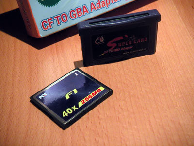
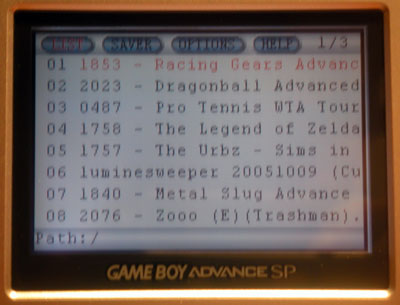
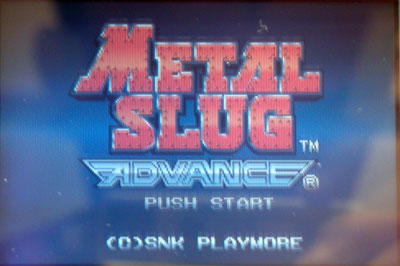
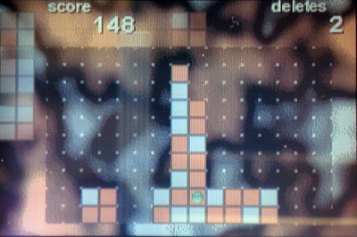

Ca faisait un moment que je lorgnais du coté des linkers flash pour mon Game Boy Advance qui prenait un peu la poussière. Mais la plupart sont assez chers, pour un espace de stockage réduit.

J'ai découvert la [SuperCard](http://www.supercard.cn/eng/index.htm), que j'ai commandée la semaine passée. Le principe est simple, il s'agit d'une cartouche au format GBA dans lequel on insère une carte Compact Flash (il existe également une version SD). Si on a déjà une carte Compact Flash, cela permet d'avoir l'équivalent d'un linker flash à un faible coût (45&#8364;).

<!-- excerpt -->

C'est un produit typique "made in China", l'emballage est très sommaire et la qualité de plastique de la cartouche fait très cheap.

Il faut utiliser un programme qui convertit les roms au bon format et permet d'activer la sauvegarde. Il suffit de copier les roms GBA de son choix via l'explorateur Windows sur la carte Compact Flash et c'est parti. On se retrouve ensuite avec une interface pour lancer les jeux&nbsp;:

La plupart des jeux GBA fonctionnent, à quelques exceptions, comme Advance Wars 2 ou Mario Kart Super Circuit. Parfois il s'agit juste de petits ralentissements ou de l'impossibilité de sauver, parfois le jeu ne fonctionne pas. Mais le développeur de la SuperCard met à jour régulièrement le firmware, donc la liste des jeux compatibles peut s'agrandir. La particularité de la SuperCard est le fait de pouvoir sauver à n'importe quelle moment sans progression dans un jeu, via le "Realtime save".

Le grand avantage de la SuperCard et des linkers flash en général, c'est qu'on peut utiliser son Game Boy pour autre cohse que l'utilisation prévue par Nintendo. Comme Les jeux homebrew, comme <a href="http://pinocchio.jk0.org/lu/" hreflang="en">Luminesweeper</a> par exemple, une version GBA du Lumines sorti sur PSP.

Mais aussi l'émulation NES, Game Boy, Sega Master System, etc. Ainsi que la lecture de videos, de fichiers musicaux et d'e-book.

Comme une carte Compact Flash demande plus d'énergie qu'une cartouche GBA classique, l'autonomie du Game Boy Advance SP s'en trouve réduite à environ 3 heures de jeu.

En conclusion, la SuperCard est un bon produit, qui va permettre d'élargir le champ d'utilisation de votre Game Boy Advance, avec un très bon rapport qualité-prix par rapport aux linkers flash.

Pour finir, quelques liens&nbsp;:

 <ul> <li><a href="http://www.supercard.cn/eng/index.htm" hreflang="en">Le site officiel de la SuperCard</a></li> <li><a href="http://www.scdev.org/" hreflang="en">SCdev.org, un site non-officiel avec un bon forum</a></li> <li><a href="http://supercard.blogspot.com/" hreflang="en">Un blog sur la SuperCard</a></li> <li><a href="http://stores.befr.ebay.be/TOUTAPASCHER-COM_W0QQssPageNameZviQ3asibQ3astoreviewQQtZkm" hreflang="fr">Une boutique eBay pour commander la SuperCard</a></li> <li><a href="http://gbalister.emubase.de/index.en.html" hreflang="en">La liste des tous les jeux Game Boy Advance</a></li> <li><a href="http://gbarts.free.fr/" hreflang="en">Des packs de screenshots pour le gestionnaire de roms GBArms</a></li> <li>Des roms <a href="http://down.tgbus.com/sort/197_1.htm" hreflang="cn">ici</a>, <a href="http://www.dgemu.com/gba.html" hreflang="en">ici</a> et <a href="http://www.mundiroms.com/index.php?seccion=GBA-Roms" hreflang="es">ici</a></li> <li><a href="http://www.foxysofts.com/index.php?l=content/gba/anworld.inc" hreflang="en">Le portage d'Another World sur GBA</a></li> <li><a href="http://www.pdroms.de/" hreflang="en">Des jeux et applications homebrew</a></li> </ul>
