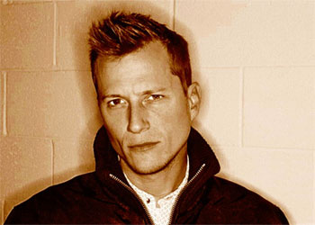
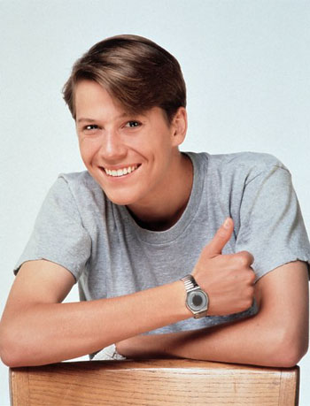

Un grand merci à Stéphane, le pote de Ced, sans qui nous n'aurions jamais découvert cette transformation.

Ce mec là. Les yeux de braise, la tête en biais, l'assurance et le charisme dignes d'un pompier de calendrier (d'un mécano plein de cambouis/ d'un homo en pleine action/ d'un motard couvert de boue.. rhaaaaaaa)

Et bien en fait, on le connait!!! On l'a même vu se lourder avec plein de filles, se faire humilier par sa soeur et rester collé à ses loosers de copains...

Alors c'est qui&nbsp;?

<!-- excerpt -->

C'est lui, Parker Lewis...(ne perd jamais) Une des séries de notre jeune temps, avec le gros Kubiac (qui joue dans Urgence maintenant) et ses autres copains [qui n'ont plus rien fait de très terrible depuis cette série](http://www.imdb.com/title/tt0098888/).

Et pour le plaisir...

  

Pour le mécano plein de cambouis, j'ai une image trop précise en tête et pas moyen de la trouver sur le net. Et pour le motard couvert de boue. Hum...ça c'est dans nos photos personnelles héhé ;-)

Et à partir d'aujourd'hui, ouverture d'une nouvelle rubrique "que sont-ils devenus"...
