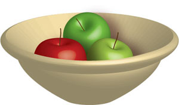
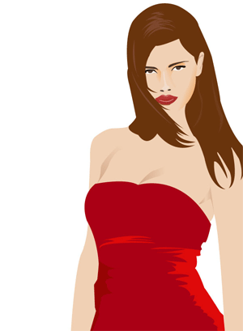
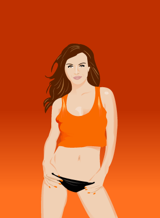
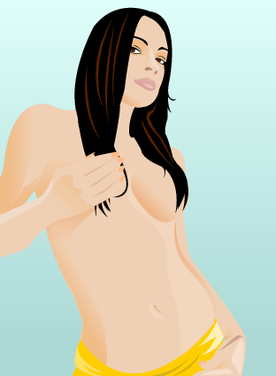
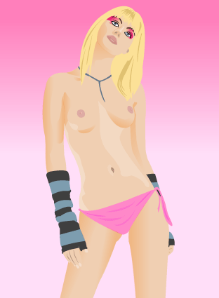

[Ce type](http://www.ndesign-studio.com/) est trop doué.  
A voir absolument&nbsp;: [son site en version flash](http://www.ndesign-studio.com/flash/index.htm).

Il est doué et il en fait profiter tout le monde grâce à [ses tutoriaux](http://www.ndesign-studio.com/resources/tutorials/index.htm). Vectorisation d'une photo, 3D, utilisation des outils, maniement des symboles....

Alors évidemment, on a testé tout ça. Ced a fait les bambous et moi le panier de pommes et la bonne femme (j'ai trouvé la photo originale sur [le vendredi c'est permis](http://www.cafzone.net/ipb/index.php?showforum=34) dans Cafzone). C'est fou ce qu'on peut faire avec quelques traits. J'ai aucune expérience en illustrator (Ced m'a juste appris à utiliser la plume et la flèche blanche) et je suis quand même assez contente du résultat. Jugez par vous-même (et montrez-nous vos résultats!)

Attention, dans la suite, des femmes dénudées.... ;-)

<!-- excerpt -->

  
C'est pas exceptionnel mais je suis trop fière de moi, je pensais pas que je serais capable de faire ça.

Enfin bref, pour ceux qui s'intéressent un peu aux vecteurs, ceux pour qui les graphistes sont des demi-dieux... j'ai trouvé les tutos super bien expliqués (faut un peu comprendre l'anglais) et on apprend plein de choses.

Incontournables également pour les fanas de vecteurs: [Made in Strator](http://www.made-in-strator.com/v2/) et [Life in Vector](http://www.lifeinvector.com/index2.html)

**MàJ**: 
Puisque je suis en congé, je mets mes nouveaux apprentissages en pratique. Après Adriana, voici Johanna.

**MàJ (encore)**: je continue (NDLR il y aura p-e une galerie illustrator au cas où je continue encore)

 
Et pour les fidèles du blog, plus on avance dans les illus, plus les demoiselles sont dénudées...

**MàJ** (promis, à partir de la prochaine, je fais une galerie) 
Après les jolies brunes, j'avais envie d'une blonde un peu spéciale... paumée dans son trip babydoll.

