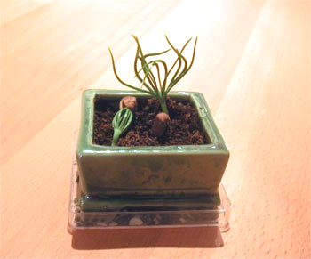

Lors de notre escapade shopping à Lille, Je n'ai pas résisté à entrer (au grand damn de Ced) dans l'immense "Nature et Découvertes". Je suis aussi rentrée plusieurs fois dans "Loisirs Créatifs" et là j'étais toute folle. Ced voulait aller chez "Planet Saturn" pour trouver Battlefield II, il tirait sur mon manteau, rampait (j'en rajoute à peine) et n'en pouvait plus de voir ce magasin de bricolages pour institutrices maternelle ou pré-pensionnées (où -soit dit en passant- j'ai acheté un kit de peinture sur verre).

Enfin je m'éloigne. Donc nous étions chez "Nature et Découvertes", je testais la résistance-shopping de mon amoureux, et j'ai acheté des graines de bonzai en me disant secrètement "Ca n'ira jamais, c'est 7 euros de perdus ". J'ai laissé ces graines de pin sylvestre se réveiller tout doucement dans de l'eau pendant 48 heures, je les ai ensuite plantées dans le bon sens dans le petit pot de terre cuite fourni dans le kit. Et là, contre toute attente, ça pousse.

<!-- excerpt -->

Les instructions disaient "ça germe vite, en une semaine vous verrez apparaitre la tête de vos graines et très vite des jeunes pousses de pin". Une semaine passe, je gratte un peu la terre en me disant "bah oui en grattant je vois la tête des graines, c'est clair". Une deuxième semaine passe...puis une troisième et oooh miracle, les voici, ces fameuses jeunes pousses. Puis ça va très vite et voici leur état actuel, elles ont 4 semaines.

Mais j'en fais quoi maintenant ? Les instructions disent d'attendre que les pousses fassent 6 à 8 cm puis de les sortir. Quoi, par ce froid de canard ? Et je change de pot ? Je suppose que 3 bonzais adultes ne tiendront pas dans ce petit pot (merde, je le trouvais joli) Dans quel pot alors ? Avec une évacuation ? Et quel terre ? Du terreau ? Y a du terreau spécial bonzaï? (Prochain testing-résistance-shopping en pépinière, t'es prévenu, mon coeur)

Enfin voila, je me pose plein de questions, j'ai été visiter quelques sites, il y en a de bons mais c'est de la théorie, tout ça... Il paraît que le pin sylvestre est à la base de l'art du bonzaï (comme quoi si je foirais mes graines, j'étais vraiment une cruche!) Il y a quelques forums qui semblent abandonnés... donc je me fie à votre grande connaissance des bonzais pour... heuuu.. me montrer la voie de la lumière... dans ma recherche de.....zenitude.
