[Nick](http://www.ndesign-studio.com/) a accepté que je traduise son tuto génialissimme et que je le mette sur le blog. Je lui ai proposé de garder ses images et il mettra sans doute un lien francophone sur son site. Grand merci à lui&nbsp;!

Petit à petit, je traduirai sans doute [ses autres tutos](http://www.ndesign-studio.com/resources/tutorials/index.htm) et lui passerai le lien à chaque fois.

Voila donc un didactitiel complet pour créer sur base de photos, des personnages relativement réalistes avec des tracés et des dégradés, sans s'ennuyer avec des outils mystérieux comme le filet (mais je commence à le comprendre, si si)

<!-- excerpt -->

1. Tout d&#8217;abord, il faut que la photo modèle soit assez grande et de bonne qualité parce qu&#8217;il faut zoomer assez fort pour des détails comme dans les yeux. On va dans Fichier &#8211; ouvrir &#8211; on choisit la photo et hop. On peut aussi juste faire un copier coller de la photo. Elle va s&#8217;ouvrir dans un calque (layer). On double-clique sur le calque et on choisit les paramètres des options. Il faut un peu changer le pourcentage pour que la photo soit plus claire, c&#8217;est plus facile pour détourer les zones. Ici Nick a mis 30% mais ça varie d&#8217;une photo à l&#8217;autre.

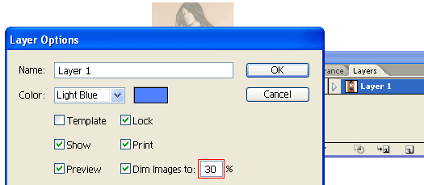

2. On fait un nouveau calque en cliquant sur la petite flèche d&#8217;options (du pavé des calques) &#8211; nouveau calque. Pour y voir clair sans devoir chipoter aux couleurs et tailles de traits, c&#8217;est possible de juste voir les bords des tracés qu&#8217;on fait. Pour ça, il faut garder ctrl enfoncé et cliquer une fois sur le petit &#339;il.

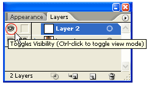

Pour tracer, il faut utiliser la plume (le porte-plume). Pendant qu&#8217;on trace, il faut réfléchir à l&#8217;ordre dans lequel les tracés devront être placés. Si on fait d&#8217;abord l&#8217;&#339;il puis la forme du visage, le visage sera au dessus de l&#8217;&#339;il (du coup on ne verra plus l&#8217;&#339;il). Donc il faudra chipoter avec «&nbsp;placer devant&nbsp;» «&nbsp;placer derrière&nbsp;»&nbsp;; Ce sont des options qu&#8217;on trouve en sélectionnant le calque et en cliquant à droite.

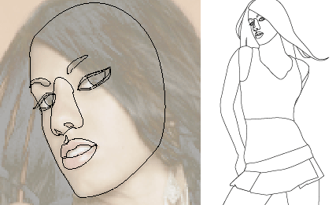

3. Faire les ombres. Une fois que la base est faite, il faut faire des ombres. On fait le tracé en suivant les zones de couleurs. On peut faire dépasser le tracé, il y a un outil qui permet de sélectionner deux tracés et couper tout ce qui dépasse. Cet outil se trouve dans fenêtre- pathfinder (sorry mais impossible de trouver l&#8217;équivalent en français &#8211; si qqun sait&#8230;.). Enfin bref, le petit pavé pathfinder va s&#8217;ouvrir et là il faut copier le visage (ctrl-c), le coller au dessus (ctrl &#8211;f), ajouter l&#8217;ombre à la sélection (garder shift enfoncé + sélectionner l&#8217;ombre), puis dans le pathfinder, on fait alt &#8211;click sur ce petit outil qui est entouré là en dessous.

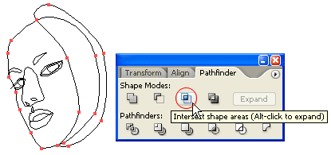

On continue avec la même technique, le visage, le corps, les habits, les cheveux, les ombres&#8230; Les raccourcis qui font gagner un temps de fou, c&#8217;est Ctrl-C et ctrl-F. Sans ça, ça prend des heures parce qu&#8217;il faut retracer les ombres exactement sur la limite du tracé du dessous.

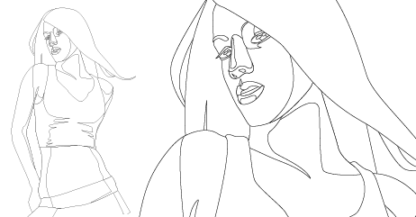

4. On remplit avec des couleurs. Dans fenêtre- bibliothèque de palettes de couleurs, c&#8217;est possible de trouver les couleurs de peaux (skintone).

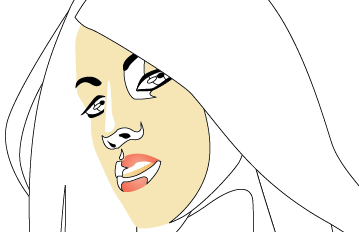

5. Remplir avec des dégradés. On sélectionne le tracé qu&#8217;on veut remplir de dégradé. Dans le pavé dégradé, dans transparence, on choisit «&nbsp;multiple&nbsp;», ça fait un fondu du tracé, en fait tout ce qui sera blanc dans le dégradé deviendra transparent. Pour choisir les couleurs du dégradé, il ne faut pas oublier, dans le pavé des couleurs, de choisir RVB (ou RGB), sinon ça reste en noir et blanc. On choisit avec la pipette dans la petite barre de couleurs (si on ne voit pas la petite barre, il faut cliquer sur la petite flèche dans le coin supérieur droit du pavé et choisir «&nbsp;montrer les options&nbsp;»). On joue ensuite avec les angles, O° c&#8217;est vertical et 90° c&#8217;est horizontal. A partir de là, il n&#8217;y a plus qu&#8217;à chipoter pour trouver la bonne direction de l&#8217;ombre par rapport au tracé.

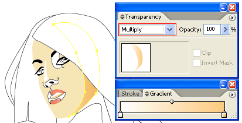

Quand le 1er tracé d&#8217;ombre est fait, pas besoin d&#8217;autant de bazar pour les autres, on sélectionne le tracé suivant qu&#8217;on veut faire en dégradé et on prend celui qu&#8217;on vient de faire en cliquant dessus avec la pipette.

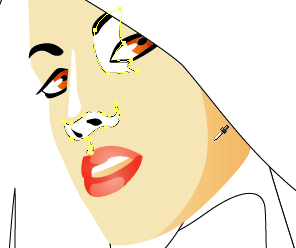

C&#8217;est la même technique pour le reste du corps

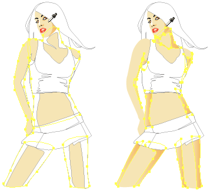

les cheveux

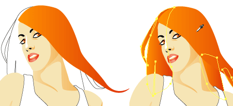

les habits et les plis des habits

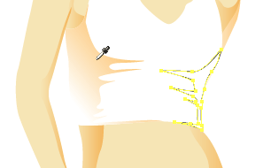

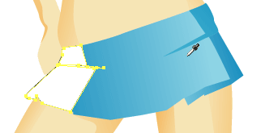

A la fin, on peut ajouter des détails dans les cheveux par exemple (ou des tatouages, des bijoux, etc.)

Et voila le résultat!

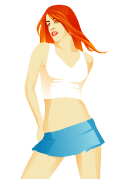

A partir de là, on est capable de faire plein de choses sur le même principe de tracés &#8211; ombres - couleurs- dégradés (des exemples de Nick)

