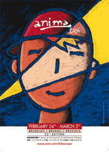

A l'occasion d'<a href="http://folioscope.awn.com/" hreflang="fr">Anima</a> qui se déroulera du 24 février au 5 mars à Bruxelles, le Festival organise deux ateliers de 2 jours.

<!-- excerpt -->

Un Masterclass <a href="http://movies.yahoo.com/shop?d=hc&amp;id=1808958664&amp;cf=gen" hreflang="en">Kyle Balda</a> (ex Pixar) à l'animation 3D. Les 27 et 28/2 de 9 h. 30 à 17 h.30, au Pathé Palace (sur inscription).

 <pre></pre> 

Un Workshop Aardman par <a href="http://movies.yahoo.com/shop?d=hc&amp;id=1809066345&amp;cf=gen" hreflang="en">Merlin Crossingham</a> sera consacré à la Pâte à modeler. Les 3 et 4/3 de 9 h. 30 à 17 h.30, au Pathé Palace (sur inscription).

 <pre>**Attention, plus que quelques places de disponible**</pre> 

<a href="http://folioscope.awn.com/cms/index.php?option=com_content&amp;task=view&amp;id=20&amp;Itemid=247&amp;lang=fr" hreflang="fr">Détails et inscription</a>
