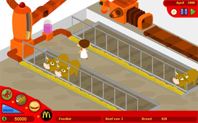
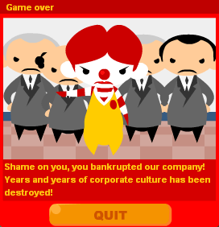
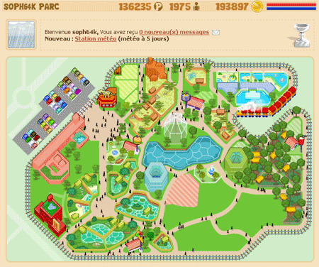

Voilà <a href="http://www.molleindustria.it/mcclic.php3?url=www.molleindustria.it/games/mcdonalds-eng.swf" hreflang="en">McDonald's videogame</a>, un jeu de gestion à la SimCity, qui est une parodie de l'entreprise créatrice du Big Mac.

Ca c'est pour Soph, entre deux parties de <a href="http://www.monzoo.net/" hreflang="fr">Monzoo.net</a>. Enfin, je sais pas trop, là on vient de lui voler un rhinocéros, du coup elle a volé un chimpanzé :-)

<!-- excerpt -->

<ins>**MàJ de Soph:**</ins>

Hum.... Un peu mal barrée pour le McDo

Par contre pour monzoo, ça va bien, ça fait 10 mois que je joue, je suis à 65% du jeu, j'ai presque 3000 visiteurs quand il y a du soleil, j'ai presque tous les sponsors, presque tous les enclos. Le plus dur pour l'instant, c'est de participer aux enchères pour remplir mon musée... Et oui, effectivement, j'ai volé un chimpanzé. J'ai envoyé un espion dans un autre zoo, il a chourré un chimpanzé et il l'a revendu sur le marché noir. Business is business :-D (mais merttt quoi mon rhinocéros!)

