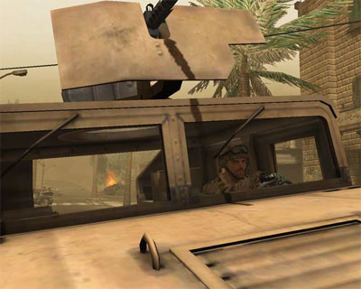

Ca y est le patch 1.2 pour Battlefield 2 est enfin disponible&nbsp;!

<!-- excerpt -->

Au menu, corrections de bugs et équilibrage des affrontements. Le nombre de missiles sur les hélicoptères passe à huit, le rayon d'effet des flashbangs a été réduit, les joueurs ne peuvent plus sauter et tirer en même temps, les missiles téléguidés ont désormais une portée plus courte, il n'est plus possible de détruire les mines avec d'autres explosifs,  les dommages avec le M134 sont diminués, le filtre de recherche des serveurs fonctionne correctement, etc.

<a href="http://www.clubic.com/patch-jeux-video-1365-0-battlefield-2.html" hreflang="fr">Télécharger la mise à jour v1.2 pour Battlefield 2</a>

Et le patch <a href="http://www.clubic.com/fiche-jeux-video-5948-0-battlefield-2-euro-force.html" hreflang="fr">Euros Forces</a> est toujours prévu à la fin du mois.
