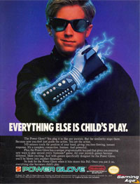

IGN nous a pondu <a href="http://xbox360.ign.com/articles/690/690449p1.html" hreflang="en">un top 10 des manettes de jeux video les plus nazes</a>. Il y a un peu de tout, le [Power Glove de Nintendo](http://www.gamerevolution.com/oldsite/articles/rants/powerglove.jpg), la [manette du Philips CD-I](http://www.playphoria.com/features/indepth/controller-ergonomics/images/thumbs/controllers-004-thumb.jpg), [l'énorme manette de la Xbox](http://www.bbspot.com/Images/News_Features/2004/02/xbox_controller.jpg), etc. Et en première position [l'ignoble chose servant à controler la Jaguar](http://www.axess.com/twilight/console/detail/jaguar.jpg). Quoi vous avez oublié la Jaguar&nbsp;? ;-)

<!-- excerpt -->

On espère que [la manette de la future Nintendo Revolution](http://media.nintendo.com/mediaFiles/EdX2WT4zfrPiOI_RoY3JWEMfpGJXu5MG.jpg) n'en fera pas partie  ^-^
