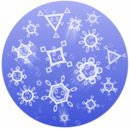
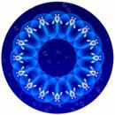

Bon bon bon... j'ai découvert un petit "jeu" super agréable sur DS. Il s'agit d'[Electroplankton](http://www.gamekult.com/tout/jeux/fiches/J000073772.html?alerte=1). En gros, on joue avec le stylet sur l'écran tactile et selon ce qu'on fait, il y a des espèces de petits poissons, planctons, plantes, gouttes, etc. qui font de la lumière, des couleurs et de la musique.

J'ai lu la critique et c'est bof. Cool pour passer un peu de temps mais ça ne dépasse pas 2 ou 3 étoiles sur <a href="http://www.gamekult.com/tout/jeux/fiches/J000073772.html?alerte=1" hreflang="fr">Gamekult</a>. 2 ou 3 étoiles pour des gens qui préfèrent jouer à Nintendogs, Urbz, Super Mario 64 DS, Advance Wars et touti quanti mais ça ferait un carton chez les autistes.

<!-- excerpt -->

  

Hé oui, n'écoutant que ma fibre professionnelle (tadaaam) j'ai décidé d'essayer de trouver un écran tactile et mendier des connaissances en actionscript pour réaliser plus ou moins le même principe qu'Electroplankton. En plus grand et moins fragile car je me vois mal apporter quelque chose comme une DS au boulot (hein Ced?).

Donc l'idée de base de la noob que je suis, c'est que sur un écran tactile, l'endroit où on met le doigt correspond au pointeur d'une souris et il ne doit pas être beaucoup plus compliqué de faire apparaitre des sons et des lumières là où d'habitude, les pros en programmation que vous êtes tous, faites changer la couleur d'un texte quand on passe dessus (enfin je crois).

Bref voila. Maintenant, je ne sais pas trop où trouver un écran tactile de récupération, pas trop cher et relativement grand et solide (et qui résiste à l'attaque de la bave).

L'écran serait utilisé dans un espace de communication particulière qu'on appelle [snoezelen](http://www.ecoles.cfwb.be/esfsaive/snoezelen.htm), qui permet une approche des personnes handicapées motrices et cérébrales par le biais des sens et de la relaxation.
