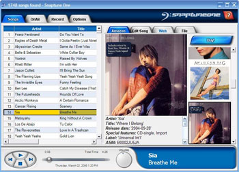

[Snaptune](http://snaptune.com/) est un logiciel qui a l'air très prometteur. Il va vous permettre d'enregistrer la radio FM. Oui vous voyez ce vieux truc qui existait bien avant Internet. Grâce auquel vous faisiez de magnifiques compiles sur votre deck K7 dans votre jeune temps.

<!-- excerpt -->

Snaptune reprend ce principe, mais y ajoute le format MP3 et surtout la reconnaissance des titres. Il suffit de brancher une radio sur l'entrée audio de votre ordinateur et il va commencer à enregistrer en détectant le nom des chansons (notamment via Amazon). C'est magique.

Le programme n'est pas encore disponible, mais il est [possible de s'inscrire pour être averti de sa sortie](http://client.snaptune.com/snaptunecom/getnotified.aspx).

(via [TechCrunch](http://fr.techcrunch.com/2006/03/06/snaptune-pour-enregistrer-votre-radio/))
