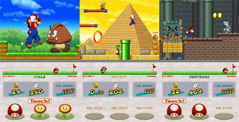

La mode est au revival. L'un des prochains gros titres attendu sur Nintendo DS s'appelera <a href="http://www.gamekult.com/tout/jeux/fiches/J000068560.html" hreflang="fr">New Super Mario Bros</a>.

<!-- excerpt -->

En gros il s'agira d'un retour aux sources du jeu NES original, sorti en 1985. Les personnages mythiques de l'univers de Mario comme Toad ou Bowser et ses méchants Koopalings seront de la partie. Par contre point de Yoshi puisqu'il n'était pas présent dans du jeu original (Yoshi est apparu pour la première fois dans Super Mario World sur Super Famicom)

Au niveau du gameplay, Nintendo nous promet quelques nouveautés comme par exemple la possiblité de se transformer en Mario géant. Mais aussi un jeu plus adapté aux hardcore gamers. Par contre ce titre n'utilisera pas le mode WiFi ni le micro de la DS.

New Super Mario Bros sortira en mai prochain au Japon.

[Voir la video](http://www.youtube.com/watch?v=PRjzqc2l6Yw&amp;search=new%20super%20mario%20bros)
