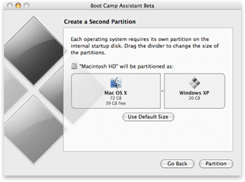

Apple met fin aux bidouilles pour pouvoir installer Windows XP sur les nouveaux Mac Intel en lançant la beta son logiciel maison : <a href="http://www.apple.com/macosx/bootcamp/publicbeta.html" hreflang="en">Boot Camp</a>. Boot Camp sera intégré à la prochaine version de Mac OS X, Leopard.

<!-- excerpt -->

"Apple n’a ni la volonté ni la perspective de commercialiser ou de supporter Windows, mais de nombreux utilisateurs ont exprimé leur souhait de pouvoir exécuter Windows sur le matériel de qualité supérieure d’Apple maintenant qu’ils sont équipés de processeurs Intel"

Maintenant on peut le dire, Windows XP tourne officiellement sur les machines de la pomme ;-)

(via <a href="http://fripi.com" hreflang="fr">Fripi</a>)
