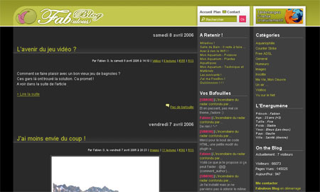

Bon, les ptits amis, on n'est pas contents. Mais alors, pas contents du tout.

Jetez un oeil sur [ce blog](http://fabien.web.free.fr/index.php)

Beau design, non ?

<!-- excerpt -->

Ca ne vous fait pas penser à quelque chose?

C'est ça le talent, c'est quand on se fait piquer son design (huhuhu). Ced a contacté le gars en lui disant que le thème n'est pas en creative commons et qu'il est prié de changer ça au plus vite. Affaire à suivre.

Merttt quoi.

**Màj**: Bon apparement c'est arrangé, le gars a répondu à notre email en disant que c'était "pour faire des tests" et il a enlevé notre design. Reste juste le screenshot.
