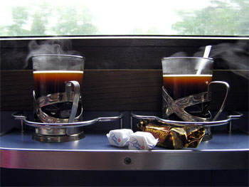

Images à titre informatif/publicitaire et copie de design de site, la même chose?

Au risque de me faire virer de [Cafzone](http://www.cafzone.net/), je vais dénoncer quelque chose que j'ai vécu aujourd'hui: Le forum anti-discussion.

<!-- excerpt -->

Pour ceux qui veulent l'intégrale du topic, c'est raté, il a été supprimé.

Donc voici un résumé, Ced a ouvert une discussion sur Cafzone, disant que machin avait pris notre design, qu'on n'était pas content, que ça fait bizarre de voir son design intégralement pompé etc etc. S'en est suivi par _truc_ une comparaison du genre "on ne veut pas se faire piquer son design mais on pique les images des autres, tatata c'est pas bien". Et c'est là que je vous vois ouvrir de grands yeux niais et ébahis et que je vous dis que vous avez raison, en effet, il n'y a pas de rapport.

_Truc_ essaie de comparer les heures passées à créer et fignoler un site web à l'utilisation d'une image non libre de droit. Pour lui c'est pareil de pomper un site et de pomper une image. Pour info, les images que nous prenons viennent de [stockexchange](http://www.sxc.hu/) et celles qui ne sont pas libres de droit nous servent à faire de la publicité pour un produit ou renvoyer à un site ou une video. Nous mentionnons tout le temps nos sources et ne nous approprions jamais le travail de qui que ce soit.

Il a aussi laissé entendre que "l'harmonie colorée de notre thème n'a rien d'original et est trouvable dans bon nombre de thèmes de forums" C'est là que j'ai vu rouge  et que je me suis laissée aller à lui dire ce que je pensais de lui (ça a beaucoup contribué à la fermeture du topic, je l'avoue)

Le topic n'est pas simplement fermé, il a carrément été supprimé. Est ce que j'y ai été un peu trop fort? J'ai été dire que vu sa réaction, _truc_ n'avait pas le moindre goût, ni la moindre fibre esthétique, ni la capacité de créer, je lui ai dit que faire un site n'est pas seulement marier des couleurs, c'est surtout passer un temps fou à coder et optimiser, mais qu'il n'est sans doute pas capable de comprendre ça. Ca a dû le rendre heureux, car ça lui a donné l'occasion de se poser en victime. Hou la méchante! Mes propos ont été soutenus par _quelqu'un qui a son mot à dire sur Cafzone_ (comme quoi je ne dis pas n'importe quoi) il a même ajouté quelque chose que j'ai trouvé très vrai, que le propre des gens qui ne savent pas créer, c'est d'être contre les propriétés individuelles, leur adage, c'est "crée, partage et tais-toi"
<pre></pre>
Plus qu'une simple dénonciation de notre petit problème personnel (de toutes façons, Fabien s'est expliqué, il a directement enlevé le design, je l'ai trouvé de bonne foi et puis si ce qu'il dit est vrai et qu'on lui a permis de s'exercer pour sa pratique du css, tant mieux pour lui), il y a manifestement un gros problème avec certaines personnes de Cafzone (et je lis souvent des topics sans m'y exprimer), c'est que si on n'est pas de l'avis général, la discussion est vite close. Avouez que c'est le comble, pour un forum de discussions! C'est frustrant pour quelqu'un comme moi qui aime les polémiques. On ne se met pas sur la gueule que je sache, il ne s'agit que de communication. J'ai aussi pu constater que tant qu'il ne s'agit pas de WoW, de mangas ou de trucs de geeks, les conversations tournent vite en eau de boudin.

Bref, pourquoi je parle de tout ça ici? Non je ne viens pas me plaindre à qui voudra bien l'entendre "ouiiin le monsieur, il a dit que notre site était moooche". Ici, on ne "lock pas rapide" comme ils disent sur Cafzone. Ici, on s'exprime et on laisse les gens s'exprimer et il y avait encore des choses à dire, dans ce topic...

**MàJ:** Au fait, pour ceux qui ne seraient pas au courant, Cafzone, c'est le site "perso" de Caféine, alias Arnaud Chaudron, le rédacteur en chef du magazine français de jeux vidéo Joystick.
