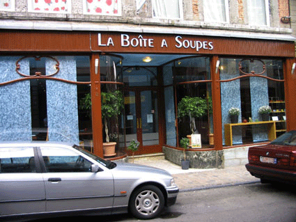
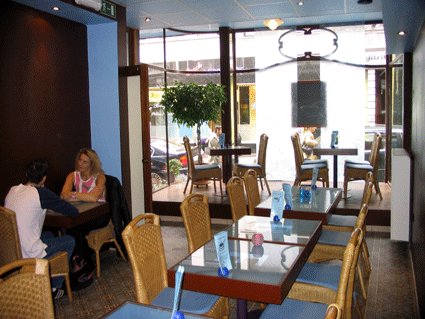

Hier soir on s'est fait une petite sortie, Ced et moi. On a été se ballader à Mons et on a soupé là. On a trouvé un petit resto sympa, ça s'appelle la Boîte à Soupes. Ils servent des soupes évidemment, mais aussi des quiches, des salades, et avec l'arrivée du bon temps, des plats de saison comme carpaccio, gaspacho, etc. Je n'ai vraiment pas pour habitude de faire de la pub pour des restos parce qu'on en sort toujours le ventre tiré, l'impression qu'on a assez mangé pour une semaine et qu'on n'aurait finalement pas dû prendre de dessert... mais là c'était vraiment bien.

Voici quelques photos gentiment envoyées par François, le gérant du resto.

<!-- excerpt -->

Le restaurant se défini comme "restaurant-décoration". La déco est turquoise et brune, il y a aux murs des cadres avec des papillons... L'ambiance est agréable, chouette musique, tables assez espacées, lumières tamisées en soirée... Le service est rapide et discret et les plats sont excellents. Nous avons chacun pris une salade et elles étaient vraiment fraîches. Pas de feuilles un peu molles, fanées ou déshydratées comme ça arrive parfois... Comme dessert, nous avons pris du "Gateau aux trois chocolats". Je m'attendais, un peu comme à Bruxelles à un minuscule carré de cake avec coulis de chocolat baignant dans une mini-flaque de sauce anglaise... et bien non, c'est carrément un quartier de gateau au chocolat, avec une couche de mousse pralinée sous une couche de mousse au chocolat blanc, le tout sous un glaçage de chocolat noir.... baignant dans la crême anglaise d'une assiette creuse. On est sorti de là rassasiés mais pas lourds (je déteste cette impression d'avoir trop mangé). Bref, on y retournera....

On aurait peut-être dû prendre une soupe, vu que c'est la spécialité, mais il faisait trop chaud hier soir. Je ne me souviens plus des noms de soupes qu'il y avait sur la carte, je me souviens juste qu'il y en avait une avec de la banane, une avec du gingembre,... Ce sera pour la prochaine fois.

Voila voila, je le redis, je ne fais jamais de pub pour des restaurants et pourtant dès que je suis sortie de là, je me suis dit que j'en parlerais sur le blog. Donc c'est qu'il vaut le coup... et puis comme vous allez être nombreux à visiter Mons pour le passage du Giro...

Le restaurant se trouve dans la rue de la Clef, numéro 33. C'est une petite rue qui débouche sur la Grand Place de Mons, facile à trouver... Pour réserver, éventuellement, voici le numéro de téléphone : 0032(0)65/59 03 59
