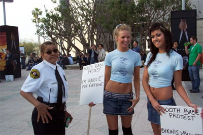

L'E3 bat son plein. Une des meilleures éditions de l'événement vidéoludique de ces dernières années. J'aurai pû vous faire un compte rendu sur la Wii qui va tout déchirer, mais tout a déjà été dit un peu partout. Surtout qu'il se passe des choses **bien plus graves** au _Convention Center_ de Los Angeles.

En effet, ce matin, des _booth babes_ évincées de la manifestation (suite à la réglementation anti-bikini et autres choses qui dépassent), ont manifesté à l'entrée du salon. Avec des pancartes où on pouvait lire les inscriptions "_Booth Babe Protest: I'm Rated E For Everyone" et "Bikinis &gt; Bullets_".

<!-- excerpt -->

En fait, les filles faisaient partie d'un buzz marketing orchestré par intellivisiongear.com, pour annoncer une after-party E3. C'est là que leur ennuis ont commencé, la mamy de la sécurité, prenant le truc au sérieux, s'est quelque peu énervée, leur disant qu'elles ne pouvaient pas manifester. Mais je vous rassure, tout est rentré dans l'ordre ^-^

Et oui les booth babes sont menacées. Heureusement, <a href="http://www.gamebe.com/actualites/3539/babes/" hreflang="fr">Nintendo est là pour protéger l'espèce</a> ^-^

(Via <a href="http://www.gamesfirst.com/?id=1312" hreflang="en">Kotaku</a>)
