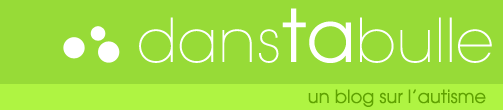

Femme d'artiste oblige, j'ai été propulsée dans le monde terrible du webdesign, des couleurs, des logos et des typos. Ne fut-ce que pour y comprendre quelque chose aux conversations. Ancienne e-exploratrice abonnée aux [fonds d'écran Windows](http://wallpaper-land.com/fond-ecran/informatique/windows-xp/fonds.htm), ancienne [Comics sans MSienne](http://bancomicsans.com/home.html), me voici depuis quelque temps sur Mac, jonglant entre Photoshop, Illustrator, ImageReady, surfant avec Firefox sur des sites de geeks, mais jamais plus qu'il ne faut, rss oblige.

Rien de plus naturel donc, que de vouloir changer les couleurs de [mon blog sur l'autisme](http://danstabulle.64k.be). Ced m'a un peu aidé pour le css (j'ai quand même fini par comprendre!) mais le design je l'ai fait moi-même-toute-seule.

<!-- excerpt -->

Donc comme pas mal de pros du design web passent par ici, je vous demande votre avis (mais soyez gentils hein, c'est mon premier) ;-)

