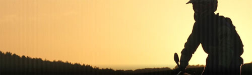

Qu'on ne vienne pas dire que je suis anti-écolo. Mais ces babacools commencent sérieusement à exagérer. Pour empêcher l'accès aux forêts wallonnes et flamandes,  ils ont lancé la circulaire Lutgen. Pour ceux qui n'auraient pas envie de lire [tout le site sur la pétition](http://www.enquete-offroad.be/fr/homepage.aspx), je résume: Depuis 1995, la circulaire interdit les véhicules à moteur en dehors des routes dans les bois et les forêts.

<!-- excerpt -->

Comment pratiquer son sport si on doit se limiter aux routes? Participer aux randonnées organisées, bien sûr. Oui sauf que récemment, la circulaire a été modifiée comme ceci :
<ul>
	<li>limitation du nombre de participants (max. 300) à des randonnées organisées (la liste nominative doit être mise à disposition 24 h à l'avance)</li>
	<li>un seul passage par participant</li>
	<li>interdiction d'organiser des randonnées les mercredis après-midi, dimanches et jours fériés (donc il reste le samedi et en semaine, quand on bosse)</li>
	<li>les activités ne peuvent avoir lieu qu'entre 9 h et 17 h (donc quand on bosse)</li>
	<li>limitations d'avril à juin et pendant les périodes de vacances</li>
	<li>une seule activité motorisée par an et par commune (no comment)</li>
	<li>une garantie bancaire de 10 € par participant doit être versée</li>
	<li>utilisation obligatoire d'aménagements pour la traversée des cours d'eau</li>
	<li>les zones Natura 2000 sont interdites à toute circulation</li>
	<li>des services de sécurité doivent obligatoirement être engagés</li>
</ul>
Il ne reste quasi rien. Un peu comme si on disait aux skieurs qui aiment le hors-piste de rester sur des pistes, comme si on disait aux vététistes de rester sur la route... bref, c'est complètement débile. Tant qu'il n'est pas possible de faire le poids contre cette circulaire, le débat est clos, la conversation est terminée.

C'est pour cela qu'il faut le plus possible de signatures sur [cette pétition](http://www.enquete-offroad.be/fr/enquete.aspx). Ne fut-ce que pour réouvrir le débat. Pour que je puisse continuer à voir mon amoureux s'amuser entre les flaques et rentrer couvert de boue (hum :-$ )

Revenons à l'écologie. Parce que oui, les moteurs ça pue, oui ça écrase des branches et des fourmis, houulala tous ces biotopes entièrement dévastés par les roues à crampons, toute cette biodiversité traumatisée par le passage de quelques motos. Et bien non, parce que les fédérations de sports motorisés font respecter [un code de bonne conduite](http://www.enquete-offroad.be/fr/code.aspx) et que respecter ce code, c'est comme respecter son sport. Bref, c'est de la bonne volonté à sens unique, il faut absolument réouvrir le débat.
