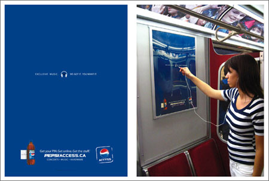

L'agence de publicité BBDO a créé une centaine d'affiches pour le métro canadien disposant chacune d'une prise jack permettant d'écouter des échantillons de musique. Il s'agit d'une campagne pour promouvoir le site <a href="http://www.pepsiaccess.ca" hreflang="en">pepsiaccess.ca</a>. Original !

<!-- excerpt -->
