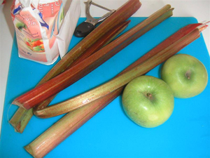
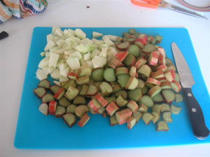
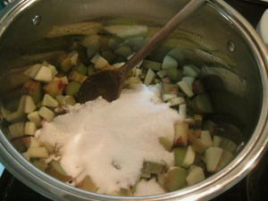
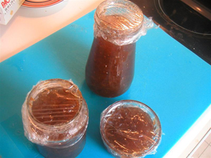

Mami Sophie aux fourneaux, comme dit Ced.

Ce matin, j'ai profité des bâtons de rhubarbe que m'a donné ma mère et des pommes que nous avons achetées hier pour faire d'autres confitures.

<!-- excerpt -->

Ingrédients pour deux gros pots:
<ul>
	<li>500 à 600 gr de rhubarbe</li>
	<li>250 à 300 gr de pommes, ici des Grany Smith</li>
	<li>autant de sucre cristallisé que de fruits (donc de 750 à 900 gr)</li>
</ul>
On coupe les fruits en petits morceaux et on les met dans la casserole, avec un tout petit fond d'eau. Très très peu d'eau car les pommes et la rhubarbe en sont gorgées.

On laisse transpirer les fruits quelques minutes en mélangeant doucement puis on ajoute le sucre. On règle un feu vif et on mélange assez souvent. C'est parti pour une demi heure de cuisson.

Une fois que la confiture est prise, on la met bouillante dans des bocaux et on stérilise ceux-ci. Si on n'a pas de stérilisateur, on peut retourner les bocaux jusqu'au lendemain.

