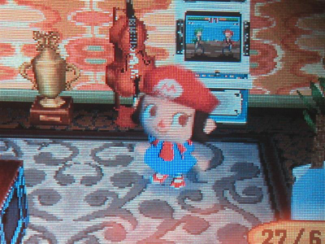

Je ne me suis pas encore lassée d'Animal Crossing... ça fait maintenant 2 mois que je joue, et ce jeu "où il n'y a rien à faire" (pfff mauvaises langues) me prend quand même pas mal de temps.. je m'amuse comme une folle. Arroser les fleurs, obtenir des hybrides, planter des fruits pour avoir des arbres, pêcher, vendre tout ce que je trouve, essayer d'avoir des collections d'objets pour la déco de ma maison (en feng shui s'il vous plait!), rembourser les prêts pour la construction de nouvelles pièces, remplir le musée de ma ville, participer aux tournois du plus gros poisson ou du plus gros insecte, participer au marché aux puces, et j'en passe....

Ma trouvaille du jour, une casquette Mario dans la boutique des Soeurs Doigts de Fée... du coup je me suis fait une petite robe Mario et me voila.. (avec ma borne d'arcade, évidemment)

<!-- excerpt -->

Excellent, non?

Il y a quelques sites de crossers (oui donc je suis une crosseuse) où je vais fréquemment pour voir les news, les astuces, les prix des poissons, des fossiles et des insectes, etc.

Un chouette forum [Animal Crossers](http://www.animal-crossers.com/main.php) où il est possible de montrer aux autres si nos portes sont ouvertes (pour le jeu en wifi), les nouveautés de chaque mois y sont détaillées (les nouveaux poissons, les nouveaux insectes, les différents évènements, concours, fêtes, etc.)

[Le skyblog de Vince Murphy](http://vincemurphy.skyblog.com/index.html), véritable bible du jeu.

[Animalxing](http://www.animalxing.com/), en anglais et plein de bonnes choses, comme les modèles de visages pixel par pixel pour Blanca, les codes-couleurs pour créer des fleurs hybrides, le placement des meubles selon le feng shui (pour avoir plus de points de l'Association des Joyeux Décorateurs)...

Aaaahlala le monde est fou....

(Bon, pitié, pas de code ami dans les commentaires, y en a eu assez sur [le dernier billet](http://64k.be/index.php/2006/04/27/438-codes-amis-animal-crossing) que j'avais fait sur le sujet...)
