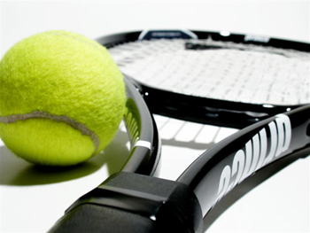

Grande résolution prise pour cet été et les saisons qui suivront: une meilleure forme physique, davantage d'activités IRL (comprenez In Real Life, bien sûr), et manger des fruits et des légumes (parce que mon bikini fait la gueule en ce moment). [Les confitures](http://64k.be/index.php/2006/06/24/467-marmelade-d-oranges-aux-epices), ça ne compte pas, trop de sucre. Non, des fruits, des vrais. Demain je me fais une pastèque. Et des légumes, des vrais. Et du soja aussi.

On va aussi faire le tour <del>des</del> de quelques attractions belges, éventuellement de quelques gîtes (hihi). L'avantage de la Belgique c'est qu'on peut être dépaysé en 100 km, alors on va en profiter. Il est possible de télécharger la brochure [Wallonie Escapades 2006](http://www2.opt.be/pdf/FR/EDW.pdf) en pdf. On va s'en inspirer pour nos ballades en amoureux...

Enfin bref, cette année on construit une maison, donc vous l'aurez compris: les vacances, ce sera à proximité et à moindres frais. J'ai une petite envie de Grange aux Corps aussi :-$ (mais siiii j'en avais déjà parlé ([commentaire n°8](http://64k.be/index.php/2005/06/19/196-festivals-de-l-ete-en-belgique)), c'est un sauna-jacuzzi-hammam-piscine-privé à louer pendant 1h15 pour 35 euros <del>pour y faire touuuus les calins qu'on veut</del> pour évacuer le stress)

<!-- excerpt -->

Et on va faire du sport. Dépaysement total si on regarde notre emploi du temps habituel. Nous avons pris une décision qui va surprendre ceux qui nous connaissent le mieux. Nous allons nous mettre au tennis. (Mais si!)

''Considéré comme un sport complet, le tennis offre à ses adeptes une multitude d’avantages physiques et psychologiques. Physiquement, les joueurs de tennis rapportent moins de maux de tête et une meilleure satisfaction sexuelle. Excellent exercice cardiopulmonaire, le tennis permet de brûler de nombreuses calories. La pratique du tennis augmente l’agilité, tonifie la musculature des jambes et du haut du corps, renforce l’ossature et améliore la flexibilité. Sur le plan psychologique, le tennis est aussi associé à des performances scolaires améliorées et une capacité mnémonique augmentée. Sa pratique régulière favorise notamment le développement de la discipline, de la responsabilité, de la résolution de problème et de l’esprit de combativité et de compétitivité, tout en permettant l’acquisition d’humilité et de franc-jeu.'' (Source: [Service Vie](http://www.servicevie.com/))

<pre></pre>
Voila voila en espérant que ce n'est pas une décision prise à la légère. On va vraiment essayer de s'y tenir. Pour ceux qui veulent une idée du prix on va payer 5 euros la location d'un terrain au [Nautisport](http://www.visithainaut.be/informations/hainaut_Visites/FR/H/V/30523.html) d'Enghien jusqu'à la fin de la saison (le 14 septembre) Ca nous laisse 10 semaines, donc 50 euros si on y va une fois par semaine. Puis si ça nous botte toujours, on pourra prendre un abonnement annuel à 120 euros pour le premier inscrit, 105 pour le second. 225 euros pour l'année, pour se garder en bonne santé, ça ne me semble pas exagéré. Surtout qu'à ce prix là, on peut y aller autant de fois qu'on veut. Ca équivaut a une grosse centaine de paquets de chips ou à +- 35 pizzas margherita.

Vive la bonne santé, vive l'amour, vive le soleil, vive l'été, alleeeiii
