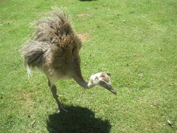

On a passé l'après-midi au Parc Paradisio hier.... Nous avons eu le coup de foudre pour une bestiole pleine de plumes, avec un long cou et des grosses pattes. On pensait que c'était un autruchon mais il n'était pas avec les autruches, il était dans la basse-cour, avec les poules, les chèvres, etc.

Alors question, est ce que quelqu'un peut nous dire ce que c'est (et par la même occasion, où s'en procurer...)

<!-- excerpt -->

