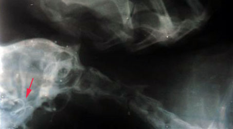

Comme tous les chats, Kéro (le chat des parents) aime manger. Un peu de tout. Aujourd'hui il a expérimenté... les hameçons. Comme vous pouvez le voir sur la radiographie, il n'a pas vraiment digéré.

<!-- excerpt -->

Le pauvre s'est retrouvé chez le vétérinaire pour une opération assez sérieuse. Mais je vous rassure ses jours ne sont plus en danger.

Moralité : faites attention à ce que vous laissez traîner :p
