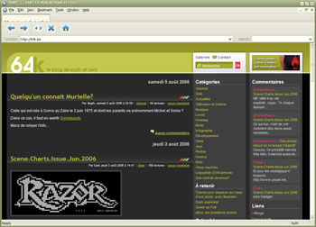

Sous Windows, on peut facilement tester un site avec les principaux des navigateurs disponibles, Firefox, Opera, etc. Sauf Safari, le principal navigateur sous Mac OS X. Safari est basé sur la bibliothèque WebKit, elle-même issue de KTML, le moteur de rendu de Konqueror sous Linux, jusqu'ici indisponible sous Windows.

C'est désormais possible, avec <a href="http://www.getwebkit.org/" hreflang="en">Swift</a>, le premier navigateur sous Windows basé sur WebKit. Il est encore en version alpha, mais il permet déjà de se faire une bonne idée de ce que donnera son site sous Safari. Très pratique quand on n'a un mac sous la main ^-^

<!-- excerpt -->

(Via <a href="http://www.chevrel.org/fr/carnet/index.php?2006/08/08/596-swift-navigateur-webbit-pour-windows" hreflang="fr">Pascal Chevrel</a>)
