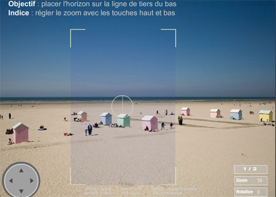

Trouvé au hasard des forums de photo que je fréquente en ce moment, [cadrez-moi](http://www.utc.fr/rendezvouscreation/francais/connaissances/outilspedagogiques/cadrezmoi/files/) est un outil pédagogique destiné à faire comprendre les règles de base d'un bon cadrage. Je dis bien les règles de base. Il n'est pas question ici de se mettre en danger en faisant des cadrages hors-norme ou de mettre à profit sa propre touche créative. Le site propose quelques explications succinctes concernant les règles de cadrage, propose ensuite quelques prises de vue qu'il faut cadrer en zoomant, en tournant, en cherchant le bon endroit.... Votre cadrage fait, vous cliquez pour prendre la photo qui sera ensuite cotée, vous aurez également l'occasion de voir la correction. Si vous avez au moins C de moyenne, vous passez au niveau supérieur...

<!-- excerpt -->

Puis pour ce qui concerne notre D50... C'est génial, on fait plein de photos... c'est LE moyen de sortir de l'appart, LA bonne raison pour éteindre l'ordinateur.. un photoblog est en préparation pour les plus jolies photos mais en attendant on a [un compte flickr](http://www.flickr.com/photos/64k/) où on met ce qui n'est pas raté...

En voici une que j'ai prise le w-e dernier, c'est un souci qui est dans le fond du jardin, dans la maison de mon enfance. J'adore les couleurs!

